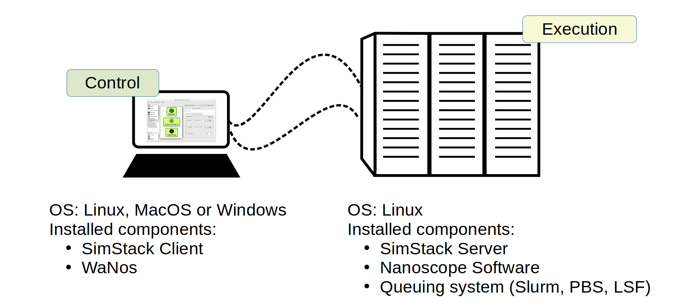

.. _getting_started_installation:

Installation
============

Software structure
-------------------

Nanoscope is designed to run on scalable computational resources.
It operates on a **Client-Server architecture**, which requires defining the `Client`—the machine you use to set up,
submit, and analyze simulations—and the `Server`—the machine where computational resources will be used to perform simulations (typically, an HPC Cluster).
Note that to test `Nanoscope`, both the `Server` and `Client` can be your laptop.
This architecture is implemented using the `SimStack workflow platform <https://simstack.readthedocs.io/>`_ .

`SimStack Client` and `SimStack Server` need to be installed on the `Client` and `Server`, respectively.
While `SimStack` provides the infrastructure, additional components specific to Nanoscope are also required:
- The **Nanoscope Simulation Software**, containing simulation algorithms, must be installed on the `Server`.
- The **WaNos** (short for **Workflow Active Nodes**), the graphical representation of Nanoscope modules, must be installed on the `Client`.

`WaNos` modules are combined into simulation workflows, one of which is Nanoscope itself.

In total the Nanoscope consists of four parts:

=============================== =======================
Module                          Installed on...
=============================== =======================
SimStack Server                 `Server`
Nanoscope Simulation Software   `Server`
SimStack Client                 `Client`
WaNos                           `Client`
=============================== =======================

The setup is summarized in the figure below.

   Overview of the Nanoscope Software Structure

.. ToDo: Align font type in pic with readthedocs

Technical requirements
-----------------------
Computational resource
^^^^^^^^^^^^^^^^^^^^^^^^
The Nanoscope modules are best executed on 32 cores or more. Especially the `ES Analysis` scales very well with the number of cores. The modules `MolPrep` and `Deposit` scale well up to 64 and 32 cores respectively. 

=============================== ======================= =======================
Feature                         Recommendation          Minimal requirement
=============================== ======================= =======================
Operating system                Linux                   Linux
Number of cores                 120 or more             16
Memory                          3 GB / core             1.5 GB / core
=============================== ======================= =======================

Client / local PC
^^^^^^^^^^^^^^^^^
There are no special requirements for the local resource where the SimStack Client and the WaNos are installed. The SimStack Client is available for Linux, Windows and MacOS.

Installation step-by-step
----------------------------
On the `Server` / HPC Cluster
^^^^^^^^^^^^^^^^^^^^^^^^^^^^^
1. Install micromamba
    ::

        "${SHELL}" <(curl -L micro.mamba.pm/install.sh)

    For details or special installation requirements, refer to the `Micromamba documentation page <https://mamba.readthedocs.io/en/latest/installation/micromamba-installation.html>`_.

2. Install the Nanoscope software
    1. Clone the `nanomatch-release Github respository <https://github.com/NanomatchGmbH/nanomatch-release.git>`_
    ::

        git clone git@github.com:NanomatchGmbH/nanomatch-release.git

    2. Go into the repository and list all available releases:
    ::

        cd nanomatch-release
        ./install_environment_helper.sh

    3. Copy and paste one of the printed commands to install the Nanoscope software. Use the **second topmost** command to get the latest version, e.g. 
    ::

        micromamba create --name=nmsci-2024.2 -f /home/tobias/Software/nanomatch/nanomatch-release/releases/nmsci-2024.2.2.conda-lock.yml

    .. note::

        To update the Nanoscope software, pull the repository 

        ::

            git pull

        and execute steps 2.2, and subsequently 2.3 with a new version, as indicated in the printed commands.

    4. Adapt the configuration file

       During the installation you will be instructed to setup a configuration file `.nanomatch.config.` Afterwards, you can activate the environment with the following command:
       ::
            micromamba activate nmsci-2024.1 # This should produce an output on first activate.

       **Check the output for details, when you activate the environment for the first time!**

       Open the `.nanomatch.config` file (typically located in your home directory) and adapt the following:

        * Scratch directory: Some of the simulations use a scratch directory for faster IO during the simulation, before final results are copied back into your workflow directory. Set this directory using
          :: 

                export SCRATCH=/scratch/

        * In case you are using a commercial license, set the license server:
          ::

                export NM_LICENSE_SERVER=localhost

          In case the CodeMeter runtime is installed on a different computer in your network than the computational resource itself, provide the corresponding IP address. See also :ref:`getting_started_licensing` for details.

3. Install the SimStack **Server**
    In the list of available installs from step 2.2 above, execute the **topmost** command to install SimStack Server:

    ::

        micromamba create --name=simstack_server_v6 -f /home/tobias/Software/nanomatch/nanomatch-release/releases/simstackserver.conda-lock.yml

Details on steps 2 and 3 are provided in the `README <https://github.com/NanomatchGmbH/nanomatch-release/blob/main/README.md>`_ of the repository.

On the `Client` / local PC
^^^^^^^^^^^^^^^^^^^^^^^^^^
1. Install micromamba
    On Linux distributions: see above

    On MacOS, use the same command as for Linux (above) or use Homebrew:
    :: 

        brew install micromamba

    On Windows via powershell:
    ::

        Invoke-Expression ((Invoke-WebRequest -Uri https://micro.mamba.pm/install.ps1).Content)

    For details or special installation requirements, refer to the `Micromamba documentation page <https://mamba.readthedocs.io/en/latest/installation/micromamba-installation.html>`_.
2. Install and run the SimStack **Client**
    Installation:
    ::

        # Create a new environment for the simstack client:
        micromamba create --name=simstack simstack -c https://mamba.nanomatch-distribution.de/mamba-repo -c conda-forge

    Run the SimStack Client:
    ::

        # Activate the environment
        micromamba activate simstack
        # and run simstack:
        simstack

    Update the SimStack Client:
    ::

        micromamba activate simstack
        micromamba update simstack -c https://mamba.nanomatch-distribution.de/mamba-repo -c conda-forge
        # Or if you need a specific version, example 1.2.5:
        micromamba install simstack=1.2.5 -c https://mamba.nanomatch-distribution.de/mamba-repo -c conda-forge

.. TODO: Double check if this holdes for Mac and Windows

3. Download the WaNos 
    WaNos are available in a `public repository <https://github.com/NanomatchGmbH/wano.git>`_. To get the WaNos, go into a directory of your choice and run
    ::

        git clone git@github.com:NanomatchGmbH/wano.git

    Make sure to remember the directory for the SimStack configuration below.

SimStack configuration
-------------------------

.. note::

    In the following we provide a brief summary of the key steps to configure SimStack. Detailed information on SimStack, including all options for setup, are available on the `SimStack documentation page <https://simstack.readthedocs.io/>`_.

Setup of passwordless ssh
^^^^^^^^^^^^^^^^^^^^^^^^^^^^

Communication between the SimStack Client and the SimStack Server requires passwordless ssh access from your local PC to your computational resource.
*On your local PC*, generate a ``ssh`` keypair and transfer the key to the ``authorized_keys`` file of your user account on the computational resource with one of the following commands:

On Linux and OSX (Arm and x64)
""""""""""""""""""""""""""""""""""""

If you don't have the ``ssh`` keys, use the steps below to generate them.

   * ``ssh`` key generation, press enter for the passphrase option.

      .. code-block:: bash

         ssh-keygen -t rsa

   * The ssh-key command generated two keys in the ``~/.ssh`` directory.
     Now, you must copy the key to your user account in one of the available HPC resources.

      .. code-block:: bash

        id_rsa
        id_rsa.pub

   * Please choose the `Client` (normally, HPC) where you want to have passwordless access.

      .. code-block:: bash

         ssh-copy-id <username>@<computer name or IP address>

   * Test the connectivity of your passwordless ``ssh``  by running one of the commands below in the **Powershell** prompt.

      .. code-block:: bash

         ssh <username>@<computer name or IP address>

   * After completing the above steps, run the below commands.

      .. code-block:: bash

         cd  simstack_linux
         ./run_simstack.sh

On Windows
""""""""""""""""""""""""""""

You have two options on Windows: You can install either the native Windows version or (in an updated WSL2 environment) the Linux version.
WSL2 comes with all client tools required, so this is the recommended approach. If you want to use the Windows version, continue this tutorial.

If you don't have the ``ssh`` keys, use the steps below to generate them.

   * Ensure the `ssh` is enabled on your Windows system.

   * Check if **Powershell** is installed on your Windows system. If not, you can install it from the Microsoft Store.

   * To generate a public/private ``rsa key pair`` on Windows, open the **Powershell** prompt run the
     below command, and press enter for the passphrase option.

     .. code-block:: bash

         ssh-keygen

   * To copy the ``ssh`` key to your user account on the HPC resource, choose and run
     one of the commands below in the **Powershell** prompt. :green:`Literally copy the command changing only the` **user**.

      .. code:: bash

         type $env:USERPROFILE\.ssh\id_rsa.pub | ssh <username>@<computer name or IP address> "cat >> .ssh/authorized_keys"

   * After completing the above steps, double-click on ``run-simstack`` and be happy.

Test the connectivity
""""""""""""""""""""""""""

You can test the connectivity of your passwordless ``ssh`` in both systems by running one of the
commands below. You successfully transferred the key if you establish the ``ssh`` connectivity to
your HPC without entering your user password.

   .. code-block:: bash

        ssh <username>@<computer name or IP address>

Configuration of the SimStack Client
^^^^^^^^^^^^^^^^^^^^^^^^^^^^^^^^^^^^^

Server Configuration within the Client
""""""""""""""""""""""""""""""""""""""""

1. Open the SimStack Client:
    ::

        # Activate the environment
        micromamba activate simstack
        # and run simstack:
        simstack

2. In the top menu, click on ``Configuration -> Servers``. Press the ``+``-button to add a new server

    .. figure:: installation/ServerSetup.png
       :alt: ServerConfiguration
       :width: 50%
       :align: center

       Server Configuration Form

    In this form, enter the following information on your computational resources:

    =============================== ==================================
    Label                           Description
    =============================== ==================================
    Hostname                        The hostname of your computational resource that is also used to login via ssh
    Port                            ssh port of your computational resource
    Username                        Your username on your computational resource
    SSH Private Key                 Set to `UseSystemDefault`
    Software Directory on Resource  Path of your micromamba on the computational resource, identify via ``echo $MAMBA_ROOT_PREFIX`` (on the computational resource)
    Calculation Basepath            Path in your home directory where workflows are executed
    Queuing System                  Queueing system in use on your computational resource to schedule jobs
    Extra config                    Leave at `None required (default)`
    =============================== ==================================

.. note::

    The data provided in the image above is only an example. Please adapt all values according to your computational resource. **Contact your system administrator** if you don't know how to set these values.

.. note::

    You can add the same computational resource multiple times, but with different ``Default Resources`` to simplify defining computational resources when setting up workflows.

Set local paths
"""""""""""""""""""
Define the local paths (on your local PC) to the WaNo directory and the workflow directory:

1. In the top menu, click on ``Configuration -> Paths``
2. Browse for the path to the directory where you cloned the WaNos (see above)
3. Browse for any directory where you wish to save workflows
4. Confirm your choice with ``Save``. 

If the correct WaNo Repository path was set, WaNos will appear in the top left panel of the SimStack Client.

.. note::

    You can choose a separate workflow directory for each research project to keep a better overview.
