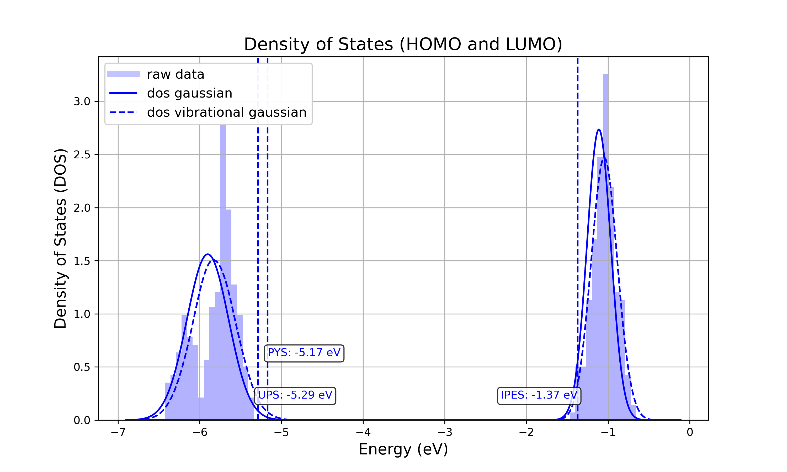

.. _getting_started_quick_start:

Quick Start Guide
==================

Introduction
-------------
This guide provides step-by-step instructions for depositing a simple thin-film morphology and performing electronic structure analysis on it using Nanoscope. It is designed to help you quickly get started with the basic functionalities of Nanoscope. For more complex use cases, please refer to the **User Guide** section.

Prerequesits
-------------
* **Nanoscope Installation**: Ensure that Nanoscope is installed on your system. If not, follow the  :ref:`getting_started_installation` to set it up.

.. _getting_started_quick_start_setup:

Production Run vs. Test Run
-----------------------------

Below, we provide settings for each module in the Nanoscope workflow.
Each module includes configurations for two types of runs: **Production Runs** for meaningful and accurate results,
and **Test Runs** for quick checks of workflow functionality and output.

.. raw:: html

   <table class="docutils" style="width: 100%; table-layout: fixed; border-collapse: collapse;">
      <thead>
         <tr>
            <th style="width: 50%; padding: 8px; border: 1px solid #ddd; text-align: left; overflow-wrap: break-word; white-space: normal;"><b>Production Runs</b></th>
            <th style="width: 50%; padding: 8px; border: 1px solid #ddd; text-align: left; overflow-wrap: break-word; white-space: normal;"><b>Test Runs</b></th>
         </tr>
      </thead>
      <tbody>
         <tr>
            <td style="padding: 8px; border: 1px solid #ddd; overflow-wrap: break-word; white-space: normal;">Settings for production runs, resulting in meaningful, accurate results.</td>
            <td style="padding: 8px; border: 1px solid #ddd; overflow-wrap: break-word; white-space: normal;">Settings suitable for quick technical tests that deliver quick (but meaningless) results also on small computational resources. </td>
         </tr>
      </tbody>
    </table>

Find out more about setups for :ref:`production runs <getting_started_production_setup>` and quick :ref:`technical tests <getting_started_test_setup>`.

Simulation Setup
-----------------

a. Design and Download the Molecule.
^^^^^^^^^^^^^^^^^^^^^^^^^^^^^^^^^^^^
    1. Open `MolView <https://www.nanomatch.de/nanomatch-files/molview/>`_  in your web browser.
    2. Design a molecule of your choice, e.g. a biphenyl molecule.
    3. Use the ``clean`` and the ``2D to 3D`` buttons to generate a 3D structure of the molecule.
    4. Download the 3D molecule file with ``Tools -> MOL file``.

        .. figure:: quick_start/quick_start_0.png
           :alt: Design a molecule with MolView
           :width: 100%
           :align: center

           Design a molecule with MolView

    .. note:: We use biphenyl as a simple example as it allows for quick computation. It is not meant as a physical case study. Feel free to try a different molecule. Keep in mind that the basic usage of Nanoscope covers molecules with up to 40 atoms.

b. Launch SimStack.
^^^^^^^^^^^^^^^^^^^
    On your local PC do the following:

    .. code-block:: bash

       micromamba activate simstack
       simstack

    This will activate SimStack environment and launch SimStack.

c. Set Up the Basic Nanoscope Workflow.
^^^^^^^^^^^^^^^^^^^^^^^^^^^^^^^^^^^^^^^

    **Drag&Drop** the modules `MolPrep`, `Deposit` and `ESAnalysis` from the top left panel into the middle workflow panel into a linear workflow and arrange as depicted below. Double click on each module to adapt settings and allocate resources for each simulation step.
    
        .. figure:: quick_start/quick_start_1.png
           :alt: Construct the workflow with drag&drop
           :width: 100%
           :align: center
        

d. Set Up Individual Modules
^^^^^^^^^^^^^^^^^^^^^^^^^^^^

    In the central panel, double-click on the module to set it up.

    1. **MolPrep**.

        * Set the `Input Molecule File`: select the molecule you created above.
        * Only for test runs:
            * Disable `Optimize Molecule`
            * Disable `Compute Dihedral Forcefield`

        .. list-table::
           :widths: 50 50
           :header-rows: 1

           * - **Production runs**
             - **Test runs**
           * - .. image:: quick_start/quick_start_molprep_prod.png
                  :width: 100%
                  :alt: MolPrep settings prod
                  :align: center
             - .. image:: quick_start/quick_start_molprep_test.png
                  :width: 100%
                  :alt: MolPrep settings test
                  :align: center

    2. **Deposit**

        * Adjust the ``Simulation Parameters`` tab:

        .. list-table::
           :widths: 50 50
           :header-rows: 1
        
           * - **Production runs**
             - **Test runs**
           * - .. image:: quick_start/quick_start_deposit_box_prod.png
                  :width: 100%
                  :alt: deposit_box_settings
                  :align: center
             - .. image:: quick_start/quick_start_deposit_box_test.png
                  :width: 100%
                  :alt: deposit_box_settings
                  :align: center

        * In the ``Molecules`` tab:

           Click on the rightmost buttons next to the input fields to load molecule and forcefield file from `MolPrep`:

             * `Molecule` input: `MolPPrep/outputs/molecule.pdb`
             * `Forcefield` input: `MolPPrep/outputs/molecule_forcefield.spf`

            .. note :: The `*.pdb`/`*.spf` files above do not yet exist; you specify the file paths where `MolProp` module will generate them.

        .. figure:: quick_start/quick_start_Deposit_mols.png
           :alt: deposit_molecules_input
           :width: 100%
           :align: center

    3. **ESAnalysis**

        * In the ``General`` tab of the ESAnalysis module, adapt the following:

            * `Morphology`: `Deposit3/outputs/structurePBC.cml` (again using the rightmost button)

        * For **Test Runs** only or if the absolute energy levels is not important:

            * Disable computation of absolute values and compute disorder and couplings only for a small shell

        .. list-table::
           :widths: 50 50
           :header-rows: 1

           * - **Production runs**
             - **Test runs**
           * - .. figure:: quick_start/quick_start_ESA_general_prod.png
                  :alt: ESAnalysis general tab
                  :width: 100%
                  :align: center
             - .. figure:: quick_start/quick_start_ESA_general_test.png
                   :alt: ESAnalysis general tab
                   :width: 100%
                   :align: center

        * In the ``Engines`` tab, set `Memory per CPU` to the total memory of your compute node divided by the number of processors.

        .. list-table::
           :widths: 50 50
           :header-rows: 1

           * - **Production runs**
             - **Test runs**
           * - .. figure:: quick_start/quick_start_ESA_engines_prod.png
                  :alt: ESAnalysis engines tab
                  :width: 100%
                  :align: center
             - .. figure:: quick_start/quick_start_ESA_engines_test.png
                   :alt: ESAnalysis engines tab
                   :width: 100%
                   :align: center

e. Set Up Resources for Every Module
^^^^^^^^^^^^^^^^^^^^^^^^^^^^^^^^^^^^

   For each module, go to the ``Resources`` tab and set the computational resources:

    * For test runs using test-settings as indicated above: Use whatever you have available
    * For production runs, the following is recommended:

       +------------+--------------+-------------+-----------+
       | Module     | CPUs         | Memory (MB) | Walltime  |
       +============+==============+=============+===========+
       | MolPrep    | ≥32          | ≥64000      | A few     |
       |            |              |             | hours     |
       +------------+--------------+-------------+-----------+
       | Deposit    | 32           | ≥64000      | A few     |
       |            |              |             | hours     |
       +------------+--------------+-------------+-----------+
       | ESAnalysis | ≥64          | ≥128000     | Several   |
       |            |              |             | hours     |
       +------------+--------------+-------------+-----------+

   .. note :: * You can run the workflow with fewer cores, if the above resources are not available. This increases runtime respectively.

        * Memory is provided in MB in the ``Resources`` tab. Running Nanoscope with less memory than indicated in the table above is possible, but you may run into out-of-memory issues especially for larger molecules.

        * Walltime is provided in seconds in the ``Resources`` tab.

f. Save and Submit the Workflow
^^^^^^^^^^^^^^^^^^^^^^^^^^^^^^^

    1. Save the workflow with ``Ctrl+S`` or by clicking ``File -> Save`` or ``File -> Save As...``
    2. Connect to your resource using the `Connect` button in the top right of SimStack. Wait for the button to become green.
    3. Submit the workflow wiht ``Ctrl+R`` or by clicking ``Run -> Run``.
 

g. Monitor Progress
^^^^^^^^^^^^^^^^^^^

    You can monitor the progress of your workflow with the ``Jobs & Workflows`` tab in the right panel of SimStack:

    1. Navigate to the ``Jobs & Workflows`` tab on the right panel.

    2. Expand **Workflows** (double click) and locate your submitted workflow (identified by timestamp if necessary).

    3. Monitor the status of the workflow and the contained modules:

       - **Green**: Completed successfully
       - **Yellow**: Currently running
       - **Red**: Encountered an error

    4. Double-click on a module to view logs, output files, and detailed status.

    .. note :: Modules are only listed in this view once they have been started, i.e. when the predecessing module was finished successfully.

    .. figure:: quick_start/quick_start_monitor.png
       :alt: progress_monitoring
       :width: 60%
       :align: center

    5. Analyze output with one of the two options:

        * Right-click on a workflow or a module and click `Browse workflow` or `Browse directory` to browse output files in a web browser.
        * Download individual files to your hard drive by double-clicking on the respective file in the panel depicted above.

Output
------

Here we present a few examples of outputs of the standard Nanoscope workflow. For a detailed description, refer to :ref:`user_guide_computed_properties` or :ref:`user_guide_examples`.

MolPrep Output
^^^^^^^^^^^^^^^

=============================== ================================================================
File                            Content
=============================== ================================================================
output_molecule.mol2            coordinates of the optimized vaccum conformation
molecule.pdb                    optimized molecular vacuum conformation, formatted for Deposit
molecule_forcefield.spf         forcefield file for Deposit
mol_data.yml                    HOMO, LUMO and static dipole
=============================== ================================================================

Deposit Output
^^^^^^^^^^^^^^^

.. table:: 
   :class: responsive-table

   =============================== ========
   File                            Content
   =============================== ========
   structure.cml                   3D coordinates of the atoms in the thin film morphology. This file can be visualized with `jmol <https://jmol.sourceforge.net/>`_
   structure.mol2                  Atom coordinates in mol2 format
   structurePBC.cml                Morphology extended periodically in x- and y-direction, lateral to the deposition axis
   summary_RDF.png                 Plot of radial distribution functions of molecular center-of-geometry (COG) positions
   visualization_2D_and_3D.png     Visualization of molecular COG positions
   output_dict.yml                 Raw data of radial distribution functions, density (in g/cm3) and simulation settings
   =============================== ========

ESAnalysis Output
^^^^^^^^^^^^^^^^^^

The primary outputs of the ESAnalysis module are located in the `Analysis/DOS` directory within the module's runtime folder.

   HOMO and LUMO distribution in a pristine morphology. The values in the figure are onsets of the distributions that compare to experimental values.

Further outputs are:

.. table:: 
   :class: responsive-table

   ==================================== ========
   File                                 Content
   ==================================== ========
   DOS_Gaussian.png                     Plot visualizing the Gaussian-broadened density of HOMO and LUMO levels without vibrational effects.
   Vibrational_Gaussian_DOS_plot.png    Plot showing the Gaussian-broadened HOMO/LUMO distribution including vibrational broadening.
   all_DOS_plot.png                     Combined plot overlaying DOS distributions with and without vibrational broadening (both are Gaussian-broadened).
   raw_data_homo_lumo.yaml              Exact HOMO and LUMO energies (in mixed morphologies for each molecule type). Includes mean, std, and all individual energy levels.
   homo_lumo_onsets.yaml                Calculated onset energies for HOMO and LUMO levels distribution for each molecule type, can be compared with experimental onsets.
   homo_lumo_centers.yaml               Mean and standard deviation of the distribution of HOMO and LUMO levels for each molecule type. Can be used as an ab-initio input for multi-scale simulation workflows.
   ==================================== ========
