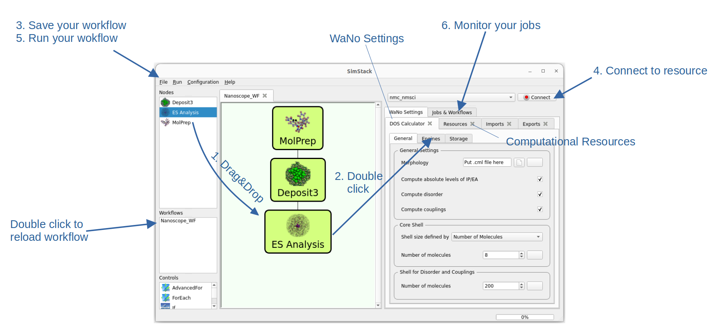
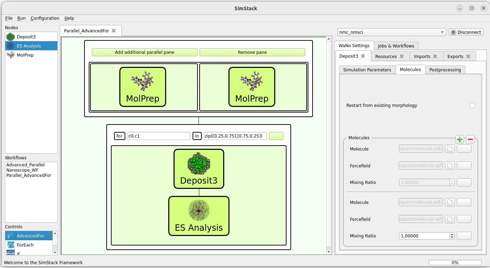

.. _getting_started_workflows:

Simulation Workflows
====================

Setup of workflows with SimStack
----------------------------------
In order to efficiently compute material properties in the thin film we use a multiscale, multi-module simulation approach covering scales from single molecule to the multi-nanometer scale of organic thin films. This requires the setup of simulation workflows consisting of multiple simulation steps. The standard Nanoscope workflow is described in :ref:`home_nanoscope_workflow`.

To simplify setup and repeated usage of workflows we utilize the SimStack Workflow Platform. Detailed information of SimStack is available on the official `SimStack Documentation <https://simstack.readthedocs.io>`_ and only key features are described here. 

   Setup of a multiscale simulation workflow

To setup a simulation workflow with SimStack, proceed as follows:

1. Drag & drop all modules, so called WaNos (Workflow Active Nodes), for your workflow from the top left panel into the middle panel and arrange as required.

2. Double click on each WaNo to modify settings and resources for this specific computation in the right side of SimStack

3. Save your workflow with `File -> Save`, or `File -> Save As` or the respective shortcuts. Saved workflows appear in the middle left panel for later re-use and can be loaded by double clicking.

4. Connect to your computational resource (top right)

5. Run your workflow with `Run -> Run` or by clicking `Ctrl + R`

6. Monitor the progress of your workflow in the Jobs & Workflows panel (top right). In this panel, double click on "Workflows" to refresh, when connected to your resource.

Information on installation of SimStack and configuration of your computational resources are provided in the :ref:`getting_started_installation` section.

Advanced Workflow Controls
------------------------------

To setup more complex workflows using parallel execution of WaNos and For-Loops, SimStack offers additional controls in the bottom left panel. For Nanoscope, the most useful controls are the "Parallel" control and the "AdvancedFor" control. An exemplified usage is the analysis of the electronic structure of molecules in a mixed morphology consisting of two components at mixture 25:75 and 75:25:

   Example usage of advanced workflows 

Parallel Control
~~~~~~~~~~~~~~~~
You can use the `Parallel` control to conduct multiple simulation steps in parallel, as far as your resources allow. One example, depicted above, is to use two parallel MolPrep runs to optimize molecular structures and compute force fields for two molecules to deposit a mixed morphology. This control only has two options: 

* `Add additional parallel pane`: Starting off with a single pane, use this button to add as many parallel panes as needed.
* `Remove pane`: This will remove the right most pane

Drag & Drop WaNos in each pane after they have been added.

AdvancedFor Control
~~~~~~~~~~~~~~~~~~~~
This control corresponds to a classical for-loop in coding language and can be used to execute the same WaNos with one settings modified by the for-loop. 

Defining a for-loop
^^^^^^^^^^^^^^^^^^^^^^
The for-loop is interpreted by python and therefore needs to be defined in **python synthax**. Therefore, any string entered after the `for` and the `in` label that results in valid python syntax will work. 
In the above example, we use the python `zip` functionality to iterate over two variables `c0` and `c1` that are later used as concentrations for the morphology generation.

Acessing the loop variables
^^^^^^^^^^^^^^^^^^^^^^^^^^^^
Loop variables can be accessed, similar to output from other WaNos, by the **button located to the right of each input field**: 

1. Identify the input value you wish to use the loop variable for. In our case these are the concentration values in Deposit.
2. Click the button right of this input field.
3. In displayed control panel, type any character to select available values to improt. Select ${`your variable name`}. In the example above, we select ${c0} for one concentration and ${c1}$ for the second concentration.
4. Press `OK` and make sure the input field is disabled, indicating that a value was imported.

Examples of advanced control usage
^^^^^^^^^^^^^^^^^^^^^^^^^^^^^^^^^^^^
Examples for usage of advanced controls is provided in the :ref:`user_guide_examples` section. A list of specific examples therein will be provided here shortly.

.. @Reviewer: Once we filled the examples section, we can provide a table here with one example for each used advanced control.

Further advanced controls
~~~~~~~~~~~~~~~~~~~~~~~~~~~
For further advanced controls, please refer to the official `SimStack Documentation <https://simstack.readthedocs.io>`_
