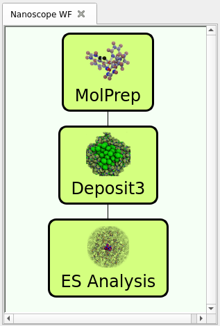

.. _home:

.. raw:: html

    

Welcome to Nanoscope!
=====================

Welcome to Nanoscope, the all-in-one simulation tool to characterize organic electronic materials in the condensed phase.

Introduction
------------
A major challenge of the R&D of organic electronic (OE) materials for e.g. OLED or OPV applications is that the properties of materials only manifest themselves in the condensed phase, i.e. when molecules are embedded in thin films. Essential properties of OE materials are therefore hard to access experimentally. To support experimental R&D of OE materials and devices, we developed Nanoscope, an all-in-one simulation tool to characterize organic electronic materials in the condensed phase.

Features
---------
Nanoscope provides a variety of outputs to help you characterize materials and material combinations, understand dependencies between structure, property and function, and use this insight to improve your OE materials and devices. These outputs include:

- Atomistic morphologies of pristine layers, mixed films or interfaces, to analyze e. g. orientation of molecules in the thin film phase, relative arrangement of molecules, etc.
- Density of states (HOMO/LUMO distributions) of molecules in the condensed phase
- Ionization potential and electron affinity of molecules in the condensed phase
- Dielectric permittivity
- Estimator for charge carrier mobility

The full list of outputs is provided in the User Guide sections :ref:`user_guide_computed_properties` and :ref:`user_guide_examples`

.. _home_nanoscope_workflow:

The Nanoscope Workflow
------------------------

Nanoscope is based on a multiscale simulation approach and the characterization of OE materials with Nanoscope typically comprises three main steps:

1. **MolPrep**: Computation of optimized 3D single molecule structures and customized forcefields.
2. **Deposit**: Generation of 3D thin film models with atomistic resolution using a PVD simulation protocol.
3. **ES Analysis**: Analysis of the electronic structure of molecules in the condensed phase, based on morphologies from Deposit.

   Characterization of OE materials using the Nanoscope multiscale simulation workflow

About Nanomatch
----------------
Nanoscope is a software provided by `Nanomatch GmbH <https://www.nanomatch.de>`_ and contains scientific simulation methods developed in close collaboration with Prof. Wolfgang Wenzel at the `Karlsruhe Institute of Technology (KIT) <https://www.int.kit.edu/wenzel.php>`_.
