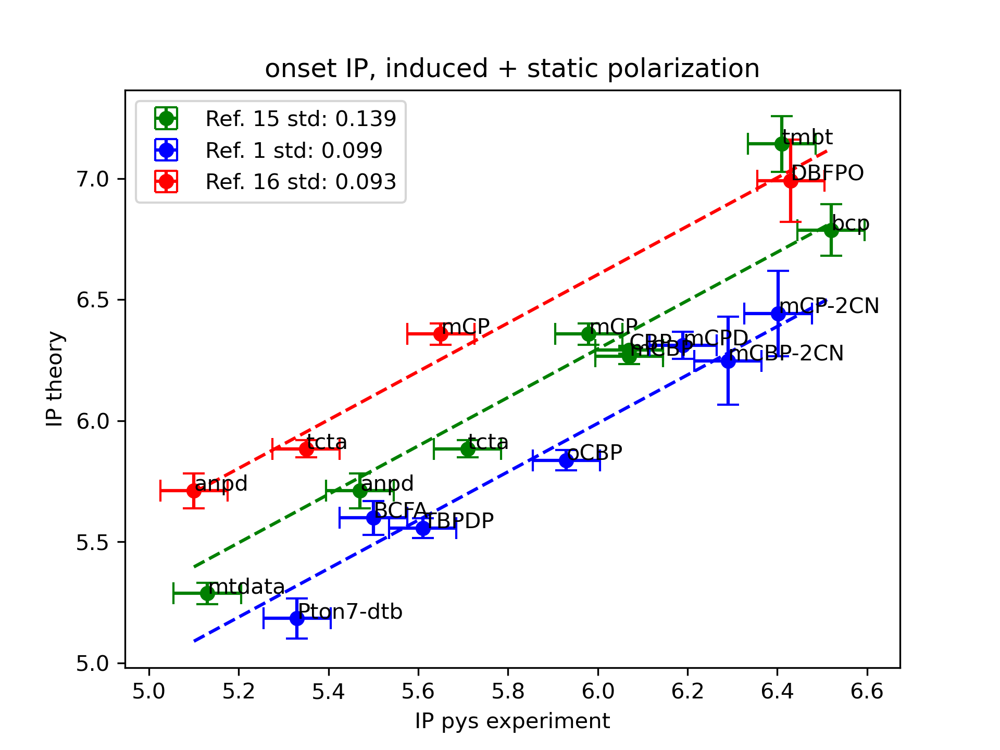
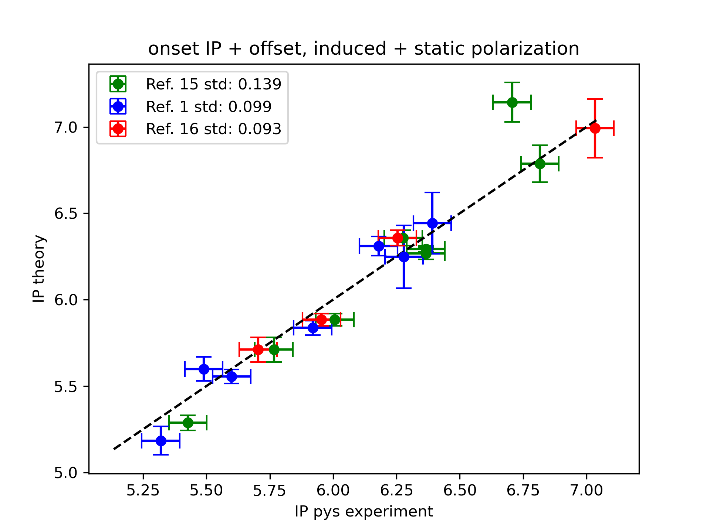

.. _science_benchmarks:

Benchmarks
==========

Validation of IP against PYS
-----------------------------

In this case study we compute the density of states (DOS) of 16 OLED molecules and compare the ionization potentials (IP) against PYS data from literature. For sake of consistency we use experimental data derived with similar experimental setup, i.e. the `AC3 <https://product.rikenkeiki.co.jp/english/ac/ac-3/>`_ setup provided by RIKEN.

The following figure shows onsets of the IP distributions computed with the Nanoscope vs. PYS values measured with AC3, as reported in literature (references below).

Within each dataset we find agreement within 100meV with the exception of tmbt. Notably, there is a systematic offset between individual datasets. If we correct for these systematic offsets we find a good global correlation:

The combined data has a standard error of approximately 60meV, which is below the experimental error of measurement of 75meV.

Further details of this benchmark are available `here <https://doi.org/10.1002/sdtp.17597>`_.

References:

* **green data**: Chem. Phys. Rev. 2, 031304 (2021); DOI: 10.1063/5.0049513
* **blue data**: Adv. Sci. 2021, 8, 2100586; DOI: 10.1002/advs.202100586
* **red data**: Adv. Optical Mater. 2019, 7, 1900630, DOI: 10.1002/adom.201900630
* Full description of this benchmark: `<https://doi.org/10.1002/sdtp.17597>`_