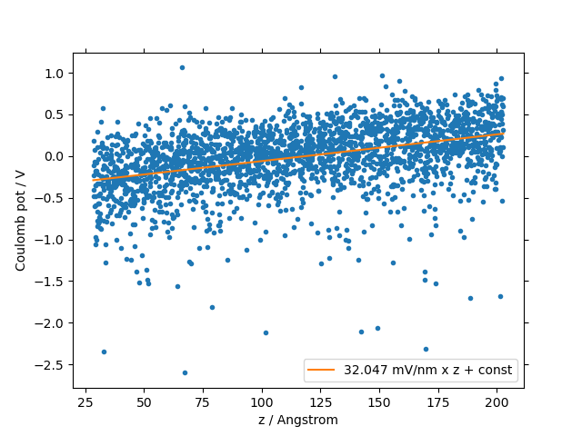

.. _user_guide_computed_properties:

Computed Properties
===================

.. list-table:: Overview of Property Groups
   :widths: 50 50
   :header-rows: 0

   * - .. centered:: :ref:`MORPHOLOGY <morphology>`

       .. image:: computed_properties/Deposit3.png
          :width: 100px
          :align: center

       :ref:`Density <density>`

       :ref:`Radial Distribution Function (RDF) <radial_distribution_function>`

       :ref:`Molecular Arrangement <molecular_arrangement>`

     - .. centered:: :ref:`POLARIZATION RESPONSE <polarization_response>`

       .. image:: computed_properties/ESAnalysis.png
          :width: 100px
          :align: center

       :ref:`Dielectric Permittivity <dielectric_permittivity>`

       :ref:`Polarization Energies <polarization_energies>`

   * - .. centered:: :ref:`EMBEDDED MOLECULES <embedded_molecules>`

       .. image:: computed_properties/MolPrep.png
          :width: 100px
          :align: center

       :ref:`Ionization Potential (IP) <ip_and_ea>`

       :ref:`Electron Affinity (EA) <ip_and_ea>`

     - .. centered:: :ref:`CHARGE TRANSPORT <charge_transport>`

       .. image:: computed_properties/lightforge2.png
          :width: 100px
          :align: center

       :ref:`Charge Carrier Mobility <mobility>`

       :ref:`Overlap Integrals <overlap_integrals>`

       :ref:`Energy Disorder <energy_disorder>`

.. note::
   Click on a property or a property group to navigate to its detailed section.

Where are computed properties
-----------------------------

In the right panel of SimStack, go to ``Jobs & Workflows``. Completed jobs (shown in green) appear here, organized by the module that generated them, as illustrated below:

+---------------------------------------------+----------------------------------------------------------+
| **Output Structure**                        | **Example**                                              |
+---------------------------------------------+----------------------------------------------------------+
| .. code-block:: text                        | .. figure:: computed_properties/where_is_output.png      |
|                                             |    :alt: progress_monitoring                             |
|     Workflows                               |    :width: 60%                                           |
|     └─── <TimeStamp><WorkflowName>          |    :align: center                                        |
|          ├── MolPrep                        |                                                          |
|          │    └── ... (files and folders)   |                                                          |
|          ├── Deposit3                       |                                                          |
|          │    └── ... (files and folders)   |                                                          |
|          └── ESAnalysis                     |                                                          |
|               └── ... (files and folders)   |                                                          |
+---------------------------------------------+----------------------------------------------------------+

.. _morphology:

**Morphology**
---------------

:ref:`viz`

:ref:`Density <density>`

:ref:`Radial Distribution Function (RDF) <radial_distribution_function>`

:ref:`Molecular Arrangement <molecular_arrangement>`

.. _viz:

Morphological Structure
-----------------------
Property description
~~~~~~~~~~~~~~~~~~~~~~~

A major output of Deposit are morphologies, i.e. 3D representations of molecular arrangement in thin films with
atomistic resolution. These morphologies are the starting point for many types of analysis, ranging from the
investigation of molecular arrangement and orientation to the analysis of the electronic structure of molecules
embedded in the thin films.

Output files
~~~~~~~~~~~~~

.. raw:: html

   <table class="docutils" style="width: 100%; table-layout: fixed; border-collapse: collapse;">
      <thead>
         <tr>
            <th style="width: 20%; padding: 8px; border: 1px solid #ddd; text-align: left; overflow-wrap: break-word; white-space: normal;">File</th>
            <th style="width: 80%; padding: 8px; border: 1px solid #ddd; text-align: left; overflow-wrap: break-word; white-space: normal;">Description</th>
         </tr>
      </thead>
      <tbody>
         <tr>
            <td style="padding: 8px; border: 1px solid #ddd; overflow-wrap: break-word; white-space: normal;">structure.cml</td>
            <td style="padding: 8px; border: 1px solid #ddd; overflow-wrap: break-word; white-space: normal;">Atom coordinates sorted by molecule in cml format.</td>
         </tr>
         <tr>
            <td style="padding: 8px; border: 1px solid #ddd; overflow-wrap: break-word; white-space: normal;">structure.mol2</td>
            <td style="padding: 8px; border: 1px solid #ddd; overflow-wrap: break-word; white-space: normal;">Atom coordinates sorted by molecule in mol2 format.</td>
         </tr>
         <tr>
            <td style="padding: 8px; border: 1px solid #ddd; overflow-wrap: break-word; white-space: normal;">structurePBC.cml</td>
            <td style="padding: 8px; border: 1px solid #ddd; overflow-wrap: break-word; white-space: normal;">Atom coordinates sorted by molecule, periodically expanded in x- and y- direction.</td>
         </tr>
      </tbody>
    </table>

.. ToDo: move to some extra section. For instance, third-party software or visualizing outputs or examples. This section is about computed properties. It is big and complex enough without this.

Example of ``structure.cml`` and ``structure.mol2`` files (visualization)
"""""""""""""""""""""""""""""""""""""""""""""""""""""""""""""""""""""""""

You can visualize the content of **cml** and **mol2** files using common molecule visualization tools such as `jmol <https://jmol.sourceforge.net/>`_ or `pymol <https://www.pymol.org/>`_.

**Visualisation of** ``structure.cml`` **with jmol**:

    .. image:: computed_properties/morph_viz_jmol.png
       :alt: morphology visualization with jmol
       :align: center
       :width: 60%

.. ToDo: move instructions away from this page

*Instructions*:

    * Get jmol from the `official jmol page <https://jmol.sourceforge.net/>`_.
    * In the terminal, move to the runtime directory of Deposit
    * Open the structure using

        .. code-block:: bash

            jmol structure.cml

    * Click on the `show all frames` button (green circle in the figure above).

**Visualisation of** ``structure.mol2`` **with pymol**:

    .. image:: computed_properties/morph_viz_pymol.png
       :alt: morphology visualization with pymol
       :align: center
       :width: 60%

.. ToDo: move instructions away from this page

*Instructions*:

    * In pymol, type `set all_states, 1` to show all molecules.
    * Get pymol from the `official pymol page <https://www.pymol.org/>`_.
    * In the terminal, move to the runtime directory of Deposit
    * Open the structure using

        .. code-block:: bash

            pymol structure.mol2

.. _density:

Density
-------

Property description
~~~~~~~~~~~~~~~~~~~~~~~
Density of thin film morphologies generated by Deposit are computed automatically after deposition.
Both mass density (g/cm3) and molecular particle density (1/cm3) as well as average molecular volume (nm3) are computed.
To avoid edge effects, both properties are computed and averaged over 20 random boxes in the morphology.
Standard deviations are provided along with the values.

Output files
~~~~~~~~~~~~~

.. raw:: html

   <table class="docutils" style="width: 100%; table-layout: fixed; border-collapse: collapse;">
      <thead>
         <tr>
            <th style="width: 20%; padding: 8px; border: 1px solid #ddd; text-align: left; overflow-wrap: break-word; white-space: normal;">File</th>
            <th style="width: 80%; padding: 8px; border: 1px solid #ddd; text-align: left; overflow-wrap: break-word; white-space: normal;">Description</th>
         </tr>
      </thead>
      <tbody>
         <tr>
            <td style="padding: 8px; border: 1px solid #ddd; overflow-wrap: break-word; white-space: normal;">output_dict.yml</td>
            <td style="padding: 8px; border: 1px solid #ddd; overflow-wrap: break-word; white-space: normal;">Mass density and corresponding standard deviation are available at keys averaged_box_density and std_box_dens, provided in g/cm3.</td>
         </tr>
         <tr>
            <td style="padding: 8px; border: 1px solid #ddd; overflow-wrap: break-word; white-space: normal;">Deposit3.stdout</td>
            <td style="padding: 8px; border: 1px solid #ddd; overflow-wrap: break-word; white-space: normal;">Standard output of the Deposit run lists the density analysis near the end of the file, lines starting with box density avg over 20 samples. First line is mass density, second line is molecular particle density. Molecular volume is listed below.</td>
         </tr>
      </tbody>
    </table>

.. _radial_distribution_function:

Radial Distribution Function (RDF)
----------------------------------

Property description
~~~~~~~~~~~~~~~~~~~~~~~
In amorphous solids, the radial distribution function (RDF) describes the probability of finding other molecules at a certain distance from a reference molecule, averaged over all molecules in the material. Molecular positions are specified by their center of geometry (COG). The first peak in the radial distribution function corresponds to the most probable distance between a reference molecule and its nearest neighbors, and represents the average nearest-neighbor distance in the material. In mixed films, RDFs are computed resolved by species.

Output files
~~~~~~~~~~~~~

.. raw:: html

   <table class="docutils" style="width: 100%; table-layout: fixed; border-collapse: collapse;">
      <thead>
         <tr>
            <th style="width: 20%; padding: 8px; border: 1px solid #ddd; text-align: left; overflow-wrap: break-word; white-space: normal;">File</th>
            <th style="width: 80%; padding: 8px; border: 1px solid #ddd; text-align: left; overflow-wrap: break-word; white-space: normal;">Description</th>
         </tr>
      </thead>
      <tbody>
         <tr>
            <td style="padding: 8px; border: 1px solid #ddd; overflow-wrap: break-word; white-space: normal;">summary_RDF.png</td>
            <td style="padding: 8px; border: 1px solid #ddd; overflow-wrap: break-word; white-space: normal;">Plot of radial distribution functions of molecular center-of-geometry (COG) positions. For mixtures, this figure contains plots of RDF between all molecular species.</td>
         </tr>
         <tr>
            <td style="padding: 8px; border: 1px solid #ddd; overflow-wrap: break-word; white-space: normal;">rdf_{uuid1}_{uuid2}.png</td>
            <td style="padding: 8px; border: 1px solid #ddd; overflow-wrap: break-word; white-space: normal;">Plots of individual rdfs between types. Exists only for mixed morphology.</td>
         </tr>
      </tbody>
    </table>

.. _molecular_arrangement:

.. ToDo: Once setup for TD-orientation is documented, change title to `Molecular arrangement in thin films: Outcoupling and GSP/SOP`

Molecular arrangement in thin films: GSP/SOP
------------------------------------------------------------

Property description
~~~~~~~~~~~~~~~~~~~~~~~
In amorphous solids, spontaneous orientation of polar molecules due to van-der-Waals interaction with the substrate may induce a potential drop across the thin film along the deposition axis. This effect is called spontaneous orientation polarization (SOP), giant surface potential (GSP) or built-in potential. We compute the slope of the potential across (in x- and y-direction infinitly extended) thin films using the orientation of molecular dipoles in deposited thin film morphologies using the `GSPAnalysis` module. Further details are available in the publications section:   :ref:`science_publications_gsp`.

Output files
~~~~~~~~~~~~~~~~~
The `GSPAnalysis` module prints the value of the potential slope into the standard output, typically named `GSPAnalysis.stdout`. Further, the figure `GSP_analysis_system_scatter_fit.png` shows the potential on all molecular sites induced by the spontaneous orientation of all dipoles in the thin film over the z-position, i.e. along the deposition axis, and the fit applied to compute the potential slope. The resulting slope is provided in the legend:

In addition, this module provides the following output files: 

.. raw:: html

   <table class="docutils" style="width: 100%; table-layout: fixed; border-collapse: collapse;">
      <thead>
         <tr>
            <th style="width: 40%; padding: 8px; border: 1px solid #ddd; text-align: left; overflow-wrap: break-word; white-space: normal;">File</th>
            <th style="width: 60%; padding: 8px; border: 1px solid #ddd; text-align: left; overflow-wrap: break-word; white-space: normal;">Description</th>
         </tr>
      </thead>
      <tbody>
         <tr>
            <td style="padding: 8px; border: 1px solid #ddd; overflow-wrap: break-word; white-space: normal;"> output_dict.yml</td>
            <td style="padding: 8px; border: 1px solid #ddd; overflow-wrap: break-word; white-space: normal;">Computed GSP value in mV/nm.</td>
         </tr>
         <tr>
            <td style="padding: 8px; border: 1px solid #ddd; overflow-wrap: break-word; white-space: normal;">GSP_analysis_system_potential_data.dat</td>
            <td style="padding: 8px; border: 1px solid #ddd; overflow-wrap: break-word; white-space: normal;">Potential computed at molecule center of geometries.</td>
         </tr>
      </tbody>
    </table>

.. _polarization_response:

**Polarization Response**
--------------------------

.. :ref:`Dielectric Permittivity <dielectric_permittivity>`

.. :ref:`Polarization Energies <polarization_energies>`

.. _dielectric_permittivity:

Dielectric Permittivity
-----------------------

Property description
~~~~~~~~~~~~~~~~~~~~~~~~~

Dielectric permittivity is a short terms used for Relative Dielectric Permittivity, and contains only electronic component of the response of the medium.

Modeling Method
""""""""""""""""

`Nanoscope` calculates the dielectric permittivity using the polarization energy as a function of the polarization shell radius.
For details, refer to the paper:

  1. :ref:`science_publications_ipea_eps_paper`,

Output Files
~~~~~~~~~~~~~

The computed dielectric permittivity results are saved as a YAML file:

::

    ESAnalysis
       └─── Analysis
              └─── DOS
                    └─── data
                           └─── dielectric_permittivity.yaml

This file contains the dielectric constant per molecule type and standard deviation of its values for various molecule types.

.. ToDo: std must be per molecule, not per molecule type. If it is large, this signals problems!

Example of ``dielectric_permittivity.yaml``
"""""""""""""""""""""""""""""""""""""""""""

.. code-block:: yaml

    dielectric_permittivity:
      value: 3.6  # Dielectric constant
      std: 0.2  # Standard deviation (for multicomponent systems)

.. _polarization_energies:

.. Polarization Energies
.. ---------------------

.. Content about Polarization Energies.

.. _embedded_molecules:

**Embedded Molecules**
------------------------

:ref:`Ionization Potential (IP) <ip_and_ea>`

:ref:`Electron Affinity (EA) <ip_and_ea>`

.. _ip_and_ea:

Ionization Potential and Electron Affinity Distributions in Organic Thin Films
------------------------------------------------------------------------------

Property description
~~~~~~~~~~~~~~~~~~~~

.. Todo: add a summary of every property like method, units, references. This makes live of the user so much easier

Ionization potential (IP) and electron affinity (EA), commonly referred to as HOMO and LUMO, are computed by the ESAnalysis module on molecules embedded in thin-film morphologies provided by Deposit. The impact of the unique electrostatic environment of each individual molecule is explicitly taken into account. This approach provides:

* Distributions of IP and EA (density of states, DOS) in organic semiconductor materials
* Shift of IP and EA in guest-host systems compared to pristine films
* Band bending at interfaces

... i.e. the investigation of IP and EA on molecules in any given setup.

Output files
~~~~~~~~~~~~

Output structure of the ES Analysis module
""""""""""""""""""""""""""""""""""""""""""""""""""

::

    Analysis
        └───DOS 
              ├───data/   # Directory containing all images.
              └───plots/  # Directory containing all data files 

Images in `Analysis/DOS/plots`
""""""""""""""""""""""""""""""""""""""""""""""""""

**1. all_DOS_asis_plot.png**

This is the most comprehensive visualization. The image below is an example for the two-component system CBP:CN6-CP(20 mol%):

.. image:: computed_properties/ip_ea/all_DOS_asis_plot.png
   :alt: all_DOS_asis_plot.png
   :align: center

**Figure: all_DOS_asis_plot.png** - Combined plot showing raw distributions of individual HOMO and LUMO levels, their Gaussian approximations, and DOS distributions with vibrational broadening effects. These are computed from individual energy levels and include onset energies. Onset values can be compared to experimental onsets (UPS, IPES, PYS).

**2. List of additional visualizations**

.. raw:: html

   <table class="docutils" style="width: 100%; table-layout: fixed; border-collapse: collapse;">
      <thead>
         <tr>
            <th style="width: 30%; padding: 8px; border: 1px solid #ddd; text-align: left; overflow-wrap: break-word; white-space: normal;">File</th>
            <th style="width: 60%; padding: 8px; border: 1px solid #ddd; text-align: left; overflow-wrap: break-word; white-space: normal;">Description</th>
            <th style="width: 10%; padding: 8px; border: 1px solid #ddd; text-align: left; overflow-wrap: break-word; white-space: normal;">Format</th>
         </tr>
      </thead>
      <tbody>
         <tr>
            <td style="padding: 8px; border: 1px solid #ddd; overflow-wrap: break-word; white-space: normal;"><a href="/_static/user_guide/computed_properties/ip_ea/DOS_Gaussian.png">DOS_Gaussian.png</a></td>
            <td style="padding: 8px; border: 1px solid #ddd; overflow-wrap: break-word; white-space: normal;">Plot visualizing the Gaussian-broadened DOS for HOMO and LUMO levels without vibrational effects.</td>
            <td style="padding: 8px; border: 1px solid #ddd; overflow-wrap: break-word; white-space: normal;">PNG</td>
         </tr>
         <tr>
            <td style="padding: 8px; border: 1px solid #ddd; overflow-wrap: break-word; white-space: normal;"><a href="/_static/user_guide/computed_properties/ip_ea/Vibrational_Gaussian_DOS_plot.png">Vibrational_Gaussian_DOS_plot.png</a></td>
            <td style="padding: 8px; border: 1px solid #ddd; overflow-wrap: break-word; white-space: normal;">Plot showing the Gaussian-broadened DOS including vibrational broadening.</td>
            <td style="padding: 8px; border: 1px solid #ddd; overflow-wrap: break-word; white-space: normal;">PNG</td>
         </tr>
         <tr>
            <td style="padding: 8px; border: 1px solid #ddd; overflow-wrap: break-word; white-space: normal;"><a href="/_static/user_guide/computed_properties/ip_ea/all_DOS_plot.png">all_DOS_plot.png</a></td>
            <td style="padding: 8px; border: 1px solid #ddd; overflow-wrap: break-word; white-space: normal;">Combined plot overlaying DOS distributions with and without vibrational broadening (both are Gaussian-broadened).</td>
            <td style="padding: 8px; border: 1px solid #ddd; overflow-wrap: break-word; white-space: normal;">PNG</td>
         </tr>
         <tr>
            <td style="padding: 8px; border: 1px solid #ddd; overflow-wrap: break-word; white-space: normal;"><a href="/_static/user_guide/computed_properties/ip_ea/all_DOS_for_uuid_4c32a0a4f1938ddc47bf6ad0b748658e.png">all_DOS_for_uuid_4c..58e.png</a></td>
            <td style="padding: 8px; border: 1px solid #ddd; overflow-wrap: break-word; white-space: normal;">Individual DOS plot for molecule type with UUID `4c32a0a4f1938ddc47bf6ad0b748658e`.</td>
            <td style="padding: 8px; border: 1px solid #ddd; overflow-wrap: break-word; white-space: normal;">PNG</td>
         </tr>
         <tr>
            <td style="padding: 8px; border: 1px solid #ddd; overflow-wrap: break-word; white-space: normal;"><a href="/_static/user_guide/computed_properties/ip_ea/all_DOS_for_uuid_7bcea01794773fc317d8fb5a8ea7c275.png">all_DOS_for_uuid_7b..75.png</a></td>
            <td style="padding: 8px; border: 1px solid #ddd; overflow-wrap: break-word; white-space: normal;">Individual DOS plot for molecule type with UUID `7bcea01794773fc317d8fb5a8ea7c275`.</td>
            <td style="padding: 8px; border: 1px solid #ddd; overflow-wrap: break-word; white-space: normal;">PNG</td>
         </tr>
      </tbody>
   </table>

.. note:: 
    1. The Gaussian-broadened DOS for HOMO (or LUMO) is obtained by calculating the mean and standard deviation from the actual distribution of HOMO (or LUMO) energy levels of individual embedded molecules. The Density of States is then plotted as a normal (Gaussian)         distribution using these computed mean and standard deviation values.
    2. When to refer to additional visualizations?

        - **For two- or three-component systems**, consider using the `all_DOS_for_uuid_*.png` plots. These plots are similar to the one shown above but are created for individual molecule types (UUIDs).
        - **If the raw distribution of energy levels for HOMO or LUMO does *not* resemble a Gaussian distribution**, automatically generated onsets (as shown here) are not relevant. In such cases, consider dedicated post-processing of raw HOMO/LUMO data (`raw_data_homo_lumo.yaml`).
        - **If the raw distribution of energy levels resembles a Gaussian distribution**, using the `Vibrational_Gaussian_DOS_plot.png`—where the vibrational distribution is approximated by a Gaussian—may result in a less noisy and more realistic representation. This approach avoids displaying finite distribution artifacts.

Data Files in `Analysis/DOS/data`
""""""""""""""""""""""""""""""""""""""""""""""""""

**Summary**

.. raw:: html

   <table class="docutils" style="width: 100%; table-layout: fixed; border-collapse: collapse;">
      <thead>
         <tr>
            <th style="width: 30%; padding: 8px; border: 1px solid #ddd; text-align: left; overflow-wrap: break-word; white-space: normal;">File</th>
            <th style="width: 60%; padding: 8px; border: 1px solid #ddd; text-align: left; overflow-wrap: break-word; white-space: normal;">Description</th>
            <th style="width: 10%; padding: 8px; border: 1px solid #ddd; text-align: left; overflow-wrap: break-word; white-space: normal;">Format</th>
         </tr>
      </thead>
      <tbody>
         <tr>
            <td style="padding: 8px; border: 1px solid #ddd; overflow-wrap: break-word; white-space: normal;"><a href="/_static/user_guide/computed_properties/ip_ea/raw_data_homo_lumo.yaml">raw_data_homo_lumo.yaml</a></td>
            <td style="padding: 8px; border: 1px solid #ddd; overflow-wrap: break-word; white-space: normal;">Exact HOMO and LUMO energies for each molecule type (UUID). Includes mean, std, and all individual energy levels.</td>
            <td style="padding: 8px; border: 1px solid #ddd; overflow-wrap: break-word; white-space: normal;">YAML</td>
         </tr>
         <tr>
            <td style="padding: 8px; border: 1px solid #ddd; overflow-wrap: break-word; white-space: normal;"><a href="/_static/user_guide/computed_properties/ip_ea/DOS_Gaussian_homo.csv">DOS_Gaussian_homo.csv</a></td>
            <td style="padding: 8px; border: 1px solid #ddd; overflow-wrap: break-word; white-space: normal;">Gaussian-broadened DOS data for HOMO levels without vibrational effects.</td>
            <td style="padding: 8px; border: 1px solid #ddd; overflow-wrap: break-word; white-space: normal;">CSV</td>
         </tr>
         <tr>
            <td style="padding: 8px; border: 1px solid #ddd; overflow-wrap: break-word; white-space: normal;"><a href="/_static/user_guide/computed_properties/ip_ea/DOS_Gaussian_lumo.csv">DOS_Gaussian_lumo.csv</a></td>
            <td style="padding: 8px; border: 1px solid #ddd; overflow-wrap: break-word; white-space: normal;">Gaussian-broadened DOS data for LUMO levels without vibrational effects.</td>
            <td style="padding: 8px; border: 1px solid #ddd; overflow-wrap: break-word; white-space: normal;">CSV</td>
         </tr>
         <tr>
            <td style="padding: 8px; border: 1px solid #ddd; overflow-wrap: break-word; white-space: normal;"><a href="/_static/user_guide/computed_properties/ip_ea/DOS_Vibrational_homo.csv">DOS_Vibrational_homo.csv</a></td>
            <td style="padding: 8px; border: 1px solid #ddd; overflow-wrap: break-word; white-space: normal;">DOS data for HOMO levels including vibrational broadening effects.</td>
            <td style="padding: 8px; border: 1px solid #ddd; overflow-wrap: break-word; white-space: normal;">CSV</td>
         </tr>
         <tr>
            <td style="padding: 8px; border: 1px solid #ddd; overflow-wrap: break-word; white-space: normal;"><a href="/_static/user_guide/computed_properties/ip_ea/DOS_Vibrational_lumo.csv">DOS_Vibrational_lumo.csv</a></td>
            <td style="padding: 8px; border: 1px solid #ddd; overflow-wrap: break-word; white-space: normal;">DOS data for LUMO levels including vibrational broadening effects.</td>
            <td style="padding: 8px; border: 1px solid #ddd; overflow-wrap: break-word; white-space: normal;">CSV</td>
         </tr>
         <tr>
            <td style="padding: 8px; border: 1px solid #ddd; overflow-wrap: break-word; white-space: normal;"><a href="/_static/user_guide/computed_properties/ip_ea/DOS_Vibrational_Gaussian_homo.csv">DOS_Vibrational_Gaussian_homo.csv</a></td>
            <td style="padding: 8px; border: 1px solid #ddd; overflow-wrap: break-word; white-space: normal;">Gaussian-broadened DOS data for HOMO levels with vibrational effects included.</td>
            <td style="padding: 8px; border: 1px solid #ddd; overflow-wrap: break-word; white-space: normal;">CSV</td>
         </tr>
         <tr>
            <td style="padding: 8px; border: 1px solid #ddd; overflow-wrap: break-word; white-space: normal;"><a href="/_static/user_guide/computed_properties/ip_ea/DOS_Vibrational_Gaussian_lumo.csv">DOS_Vibrational_Gaussian_lumo.csv</a></td>
            <td style="padding: 8px; border: 1px solid #ddd; overflow-wrap: break-word; white-space: normal;">Gaussian-broadened DOS data for LUMO levels with vibrational effects included.</td>
            <td style="padding: 8px; border: 1px solid #ddd; overflow-wrap: break-word; white-space: normal;">CSV</td>
         </tr>
         <tr>
            <td style="padding: 8px; border: 1px solid #ddd; overflow-wrap: break-word; white-space: normal;"><a href="/_static/user_guide/computed_properties/ip_ea/homo_lumo_onsets.yaml">homo_lumo_onsets.yaml</a></td>
            <td style="padding: 8px; border: 1px solid #ddd; overflow-wrap: break-word; white-space: normal;">Calculated onset energies for HOMO and LUMO levels for each molecule type, can be compared with experimental onsets.</td>
            <td style="padding: 8px; border: 1px solid #ddd; overflow-wrap: break-word; white-space: normal;">YAML</td>
         </tr>
         <tr>
            <td style="padding: 8px; border: 1px solid #ddd; overflow-wrap: break-word; white-space: normal;"><a href="/_static/user_guide/computed_properties/ip_ea/homo_lumo_centers.yaml">homo_lumo_centers.yaml</a></td>
            <td style="padding: 8px; border: 1px solid #ddd; overflow-wrap: break-word; white-space: normal;">Mean and standard deviation of the DOS distributions for HOMO and LUMO levels for each molecule type. Can be used as an ab-initio input for multi-scale simulation workflows.</td>
            <td style="padding: 8px; border: 1px solid #ddd; overflow-wrap: break-word; white-space: normal;">YAML</td>
         </tr>
      </tbody>
   </table>

.. note:: Click on the link to download an example of the generated data for the two-component system CBP:CN6-CP(20 mol%).

**Data File Structures**

1. `raw_data_homo_lumo.yaml`

    .. code-block:: yaml
    
        <uuid1>:
          homo:
            mean: float
            std: float
            all:
              - float
              - float
              ...
          lumo:
            mean: float
            std: float
            all:
              - float
              - float
              ...
        <uuid2>:
          ...

2. `DOS_*.csv` files.

    The CSV files store Density of States (DOS) data for HOMO and LUMO levels with various broadening conditions.
    Each file maintains a consistent energy range and resolution, making it easy to plot them together.

    Each CSV file follows the same structure with the following columns:

    .. list-table:: Structure of DOS CSV Files
       :widths: 20 20 20 20 20
       :header-rows: 1

       * - energy
         - uuid1
         - uuid2
         - ...
         - uuidN
       * - float
         - float
         - float
         - ...
         - float

    With the following properties:

    * **energy**: The energy values [eV] over which the DOS is calculated.
    * **uuid1** to **uuidN**: Each subsequent column represents the DOS values for a specific molecule type identified by its UUID.

3. `homo_lumo_onsets.yaml`

    .. code-block:: yaml

        <uuid1>:
          homo:
            UPS: float  # Ultraviolet Photoemission Spectroscopy onset energy
            PYS: float  # Photoemission Yield Spectroscopy onset energy
          lumo:
            IPES: float # Inverse Photoemission Spectroscopy onset energy
        <uuid2>:
          ...

4. `homo_lumo_centers.yaml`

    .. code-block:: yaml

        <uuid1>:
          homo:
            mean: float  # Mean energy of the HOMO distribution
            std: float   # Standard deviation of the HOMO distribution
          lumo:
            mean: float  # Mean energy of the LUMO distribution
            std: float   # Standard deviation of the LUMO distribution
        <uuid2>:

.. _charge_transport:

.. CHARGE TRANSPORT
.. ----------------

.. :ref:`Charge Carrier Mobility <mobility>`

.. :ref:`Overlap Integrals <overlap_integrals>`

.. :ref:`Energy Disorder <energy_disorder>`

.. _mobility:

.. Charge Carrier Mobility
.. -----------------------

Property description
~~~~~~~~~~~~~~~~~~~~~

Charge carrier mobility is a measure of the speed at which charge carriers, such as electrons or holes,
can move through a material when an electric field is applied. It reflects the material's ability to conduct charge and
is influenced by various intrinsic and extrinsic factors.

Modeling Method
"""""""""""""""""""
`Nanoscope` estimates the electron and hole mobility using the Generalized Effective Medium Model (GEMM) method
using the formula:

.. math::

   \mu = \frac{e \cdot \beta \cdot M \cdot \langle J^2 r^2 \rangle}{n \cdot \hbar \cdot \sqrt{\lambda}}
         \cdot \sqrt{\frac{\pi \cdot \beta}{1 + \frac{\beta \cdot \sigma^2}{\lambda}}}
         \cdot \exp\left(-C \cdot (\beta \cdot \sigma)^2 - C \cdot \beta \cdot \lambda\right)

For more details about GEMM, refer to publications:

  1. :ref:`science_publications_GEMM_1`,
  2. :ref:`science_publications_GEMM_2`

Parameters in the formula are explained below.

Constants
"""""""""

Universal constants:

- :math:`e` is the elementary charge,
- :math:`\beta = \frac{1}{k_B \cdot T}` with :math:`k_B` being the Boltzmann constant and :math:`T` being the temperature,
- :math:`n` is the dimensionality of the system,
- :math:`\hbar` is the reduced Planck's constant,

Other parameters are explained below.

Fixed Parameters
"""""""""""""""""

Parameters below are not very material-specific and we fix their values to provide the best agreement with experiments / reference kMC studies:

- :math:`T`: Temperature, fixed to 300 K,
- :math:`M`: Mean number of nearest neighbors, fixed to 8.0,
- :math:`C`: Empirical parameter, fixed to 0.25 to provide the best agreement with experiments for small organic molecules.
- :math:`\lambda`: Reorganization energy, fixed to 200 meV.

Computed Parameters
"""""""""""""""""""

Parameters below are highly materials-specific and are computed with `Nanoscope`:

- :math:`\sigma`: Energy disorder due to environmental variations in molecular energy levels, [:math:`eV`],
- :math:`J`: Electronic couplings  between molecules, [:math:`eV`],
- :math:`r`: Intermolecular distances (between centers of the geometry) [:math:`Å`]

:math:`\langle J^2 r^2 \rangle` is the mean of the squared product of :math:`J` and :math:`r`, units: [:math:`eV²·Å²`].

Output Files
~~~~~~~~~~~~~

The computed mobility for both holes and electrons is saved as a YAML file:.

::

    ESAnalysis
       └─── Analysis
              └─── DOS
                    └─── data
                           └─── mobility.yaml

It contains the computed values of hole and electron mobilities, along with detailed parameters used for the calculation.

Example of ``mobility.yaml`` file
""""""""""""""""""""""""""""""""""

.. code-block:: yaml

    hole_mobility:
      unit: cm²/V·s
      value: 2.09e-5  # hole mobility in cm2/Vs
      parameters:
        J2_r2: 1.42e-3  # (eV²·Å²)
        lambda_eV: 0.266  # eV
        sigma: 0.13  # eV
        T: 290  # K
        M: 8.16
        n: 3
        C: 0.25
    electron_mobility:
      unit: cm²/V·s
      value: 1.01e-10  # electron mobility in cm2/Vs
      parameters:
        J2_r2: 9.99e-3  # (eV²·Å²)
        lambda_eV: 0.296
        sigma: 0.224
        T: 290
        M: 7.31
        n: 3
        C: 0.25

.. _overlap_integrals:

.. Overlap Integrals
.. -----------------

.. Content about Overlap Integrals.

.. _energy_disorder:

.. Energy Disorder
.. ---------------

.. Content about Energy Disorder.
