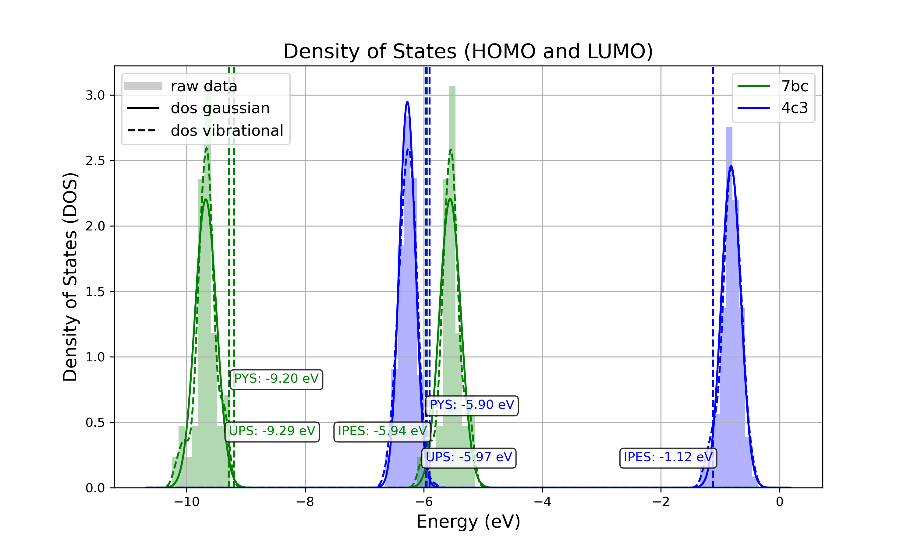

.. _user_guide_computed_properties:

Computed Properties
===================

Ionization potential and electron affinity distributions in organic thin films
-------------------------------------------------------------------------------------------

Property description
^^^^^^^^^^^^^^^^^^^^
Ionization potential (IP) and electron affinity (EA), commonly referred to as HOMO and LUMO, are computed by the ESAnalysis module on molecules embedded in thin-film morphologies provided by Deposit. The impact of the unique electrostatic environment of each individual molecule is explicitly take into account. This approach provides: 

* Distributions of IP and EA (density of states, DOS) in organic semiconductor materials
* Shift of IP and EA in guest-host systems compared to pristine films
* Band bending at interfaces

... i.e. the investigation of IP and EA on molecules in any given setup.

Output files
^^^^^^^^^^^^
Output structure of the ES Analysis module
~~~~~~~~~~~~~~~~~~~~~~~~~~~~~~~~~~~~~~~~~~~~~~~

::

    Analysis
        └───DOS 
              ├───data/   # Directory containing all images.
              └───plots/  # Directory containing all data files 

Images in `Analysis/DOS/plots`
~~~~~~~~~~~~~~~~~~~~~~~~~~~~~~~~

**1. all_DOS_asis_plot.png**

This is the most comprehensive visualization. The image below is an example for the two-component system CBP:CN6-CP(20 mol%):

**Figure: all_DOS_asis_plot.png** - Combined plot showing raw distributions of individual HOMO and LUMO levels, their Gaussian approximations, and DOS distributions with vibrational broadening effects. These are computed from individual energy levels and include onset energies. Onset values can be compared to experimental onsets (UPS, IPES, PYS).

**2. List of additional visualizations**

.. raw:: html

   <table>
      <thead>
         <tr>
            <th>File</th>
            <th>Description</th>
            <th>Format</th>
         </tr>
      </thead>
      <tbody>
         <tr>
            <td><a href="/_static/user_guide/computed_properties/ip_ea/DOS_Gaussian.png">DOS_Gaussian.png</a></td>
            <td>Plot visualizing the Gaussian-broadened DOS for HOMO and LUMO levels without vibrational effects.</td>
            <td>PNG</td>
         </tr>
         <tr>
            <td><a href="/_static/user_guide/computed_properties/ip_ea/Vibrational_Gaussian_DOS_plot.png">Vibrational_Gaussian_DOS_plot.png</a></td>
            <td>Plot showing the Gaussian-broadened DOS including vibrational broadening.</td>
            <td>PNG</td>
         </tr>
         <tr>
            <td><a href="/_static/user_guide/computed_properties/ip_ea/all_DOS_plot.png">all_DOS_plot.png</a></td>
            <td>Combined plot overlaying DOS distributions with and without vibrational broadening (both are Gaussian-broadened).</td>
            <td>PNG</td>
         </tr>
         <tr>
            <td><a href="/_static/user_guide/computed_properties/ip_ea/all_DOS_for_uuid_4c32a0a4f1938ddc47bf6ad0b748658e.png">all_DOS_for_uuid_4c..58e.png</a></td>
            <td>Individual DOS plot for molecule type with UUID `4c32a0a4f1938ddc47bf6ad0b748658e`.</td>
            <td>PNG</td>
         </tr>
         <tr>
            <td><a href="/_static/user_guide/computed_properties/ip_ea/all_DOS_for_uuid_7bcea01794773fc317d8fb5a8ea7c275.png">all_DOS_for_uuid_7b..75.png</a></td>
            <td>Individual DOS plot for molecule type with UUID `7bcea01794773fc317d8fb5a8ea7c275`.</td>
            <td>PNG</td>
         </tr>
      </tbody>
   </table>

.. note:: 
    1. The Gaussian-broadened DOS for HOMO (or LUMO) is obtained by calculating the mean and standard deviation from the actual distribution of HOMO (or LUMO) energy levels of individual embedded molecules. The Density of States is then plotted as a normal (Gaussian)         distribution using these computed mean and standard deviation values.
    2. When to refer to additional visualizations?

        - **For two- or three-component systems**, consider using the `all_DOS_for_uuid_*.png` plots. These plots are similar to the one shown above but are created for individual molecule types (UUIDs).
        - **If the raw distribution of energy levels for HOMO or LUMO does *not* resemble a Gaussian distribution**, automatically generated onsets (as shown here) are not relevant. In such cases, consider dedicated post-processing of raw HOMO/LUMO data (`raw_data_homo_lumo.yaml`).
        - **If the raw distribution of energy levels resembles a Gaussian distribution**, using the `Vibrational_Gaussian_DOS_plot.png`—where the vibrational distribution is approximated by a Gaussian—may result in a less noisy and more realistic representation. This approach avoids displaying finite distribution artifacts.

Data Files in `Analysis/DOS/data`
~~~~~~~~~~~~~~~~~~~~~~~~~~~~~~~~~~~~~~~~~~~~~~~

**Summary**

.. raw:: html

   <table>
      <thead>
         <tr>
            <th>File</th>
            <th>Description</th>
            <th>Format</th>
         </tr>
      </thead>
      <tbody>
         <tr>
            <td><a href="/_static/user_guide/computed_properties/ip_ea/raw_data_homo_lumo.yaml">raw_data_homo_lumo.yaml</a></td>
            <td>Exact HOMO and LUMO energies for each molecule type (UUID). Includes mean, std, and all individual energy levels.</td>
            <td>YAML</td>
         </tr>
         <tr>
            <td><a href="/_static/user_guide/computed_properties/ip_ea/DOS_Gaussian_homo.csv">DOS_Gaussian_homo.csv</a></td>
            <td>Gaussian-broadened DOS data for HOMO levels without vibrational effects.</td>
            <td>CSV</td>
         </tr>
         <tr>
            <td><a href="/_static/user_guide/computed_properties/ip_ea/DOS_Gaussian_lumo.csv">DOS_Gaussian_lumo.csv</a></td>
            <td>Gaussian-broadened DOS data for LUMO levels without vibrational effects.</td>
            <td>CSV</td>
         </tr>
         <tr>
            <td><a href="/_static/user_guide/computed_properties/ip_ea/DOS_Vibrational_homo.csv">DOS_Vibrational_homo.csv</a></td>
            <td>DOS data for HOMO levels including vibrational broadening effects.</td>
            <td>CSV</td>
         </tr>
         <tr>
            <td><a href="/_static/user_guide/computed_properties/ip_ea/DOS_Vibrational_lumo.csv">DOS_Vibrational_lumo.csv</a></td>
            <td>DOS data for LUMO levels including vibrational broadening effects.</td>
            <td>CSV</td>
         </tr>
         <tr>
            <td><a href="/_static/user_guide/computed_properties/ip_ea/DOS_Vibrational_Gaussian_homo.csv">DOS_Vibrational_Gaussian_homo.csv</a></td>
            <td>Gaussian-broadened DOS data for HOMO levels with vibrational effects included.</td>
            <td>CSV</td>
         </tr>
         <tr>
            <td><a href="/_static/user_guide/computed_properties/ip_ea/DOS_Vibrational_Gaussian_lumo.csv">DOS_Vibrational_Gaussian_lumo.csv</a></td>
            <td>Gaussian-broadened DOS data for LUMO levels with vibrational effects included.</td>
            <td>CSV</td>
         </tr>
         <tr>
            <td><a href="/_static/user_guide/computed_properties/ip_ea/homo_lumo_onsets.yaml">homo_lumo_onsets.yaml</a></td>
            <td>Calculated onset energies for HOMO and LUMO levels for each molecule type, can be compared with experimental onsets.</td>
            <td>YAML</td>
         </tr>
         <tr>
            <td><a href="/_static/user_guide/computed_properties/ip_ea/homo_lumo_centers.yaml">homo_lumo_centers.yaml</a></td>
            <td>Mean and standard deviation of the DOS distributions for HOMO and LUMO levels for each molecule type. Can be used as an ab-initio input for multi-scale simulation workflows.</td>
            <td>YAML</td>
         </tr>
      </tbody>
   </table>

.. note:: Click on the link to download an example of the generated data for the two-component system CBP:CN6-CP(20 mol%).

**Data File Structures**

1. `raw_data_homo_lumo.yaml`

    .. code-block:: yaml
    
        <uuid1>:
          homo:
            mean: float
            std: float
            all:
              - float
              - float
              ...
          lumo:
            mean: float
            std: float
            all:
              - float
              - float
              ...
        <uuid2>:
          ...

2. `DOS_*.csv` files.

    The CSV files store the Density of States (DOS) data for HOMO and LUMO levels under different broadening conditions. All CSV files share a consistent energy range and resolution to be easily representable on the same plot.

    Each CSV file follows the same structure with the following columns:

        .. raw:: html
    
           <table>
              <thead>
                 <tr>
                    <th>energy</th>
                    <th>uuid1</th>
                    <th>uuid2</th>
                    <th>...</th>
                    <th>uuidN</th>
                 </tr>
              </thead>
              <tbody>
                 <tr>
                    <td>float</td>
                    <td>float</td>
                    <td>float</td>
                    <td>...</td>
                    <td>float</td>
                 </tr>
              </tbody>
           </table>

    With the following properties:

    * **energy**: The energy values [eV] over which the DOS is calculated.
    * **uuid1** to **uuidN**: Each subsequent column represents the DOS values for a specific molecule type identified by its UUID.

3. `homo_lumo_onsets.yaml`

    .. code-block:: yaml

        <uuid1>:
          homo:
            UPS: float  # Ultraviolet Photoemission Spectroscopy onset energy
            PYS: float  # Photoemission Yield Spectroscopy onset energy
          lumo:
            IPES: float # Inverse Photoemission Spectroscopy onset energy
        <uuid2>:
          ...

4. `homo_lumo_centers.yaml`

    .. code-block:: yaml

        <uuid1>:
          homo:
            mean: float  # Mean energy of the HOMO distribution
            std: float   # Standard deviation of the HOMO distribution
          lumo:
            mean: float  # Mean energy of the LUMO distribution
            std: float   # Standard deviation of the LUMO distribution
        <uuid2>:
          ...

Dielectric permittivity
-------------------------

Charge carrier mobility
-------------------------

Molecular arrangement in thin films: Outcoupling and GSP/SOP
--------------------------------------------------------------

Density and Radial distribution function
--------------------------------------------

.. _ug_cp_orientation:

Output file reference
-----------------------