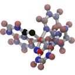
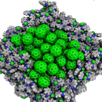
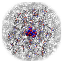

.. _user_guide_settings:

Settings and Options
====================

This section contains a reference of all settings available in the individual modules. Refer to the :ref:`user_guide_examples` section to learn how different settings may be applied.

MolPrep
---------

.. this is the table that below represented as html. Change it here and let LLM format it as below.
.. +--------------------+-------------------------------------------------------+----------------+
.. | Setting            | Description                                           | Standard value |
.. +====================+=======================================================+================+
.. | Input Molecule     |Input file in mol, mol2, pdb, cml or xyz format. Refer to the first steps of | N/A            |
.. | File               |:ref:`getting_started_quick_start_setup` for           |                |
.. |                    |instructions how to generate input files.              |                |
.. +--------------------+-------------------------------------------------------+----------------+
.. | Molecule Identifier|A 3-letter numeric string to label the molecule        | ABC (random)   |
.. |                    |throughout the workflow in various output files        |                |
.. -----------------+-------------------------------------------------------+----------------+
.. | Optimize Molecule  |Optimize the molecule with DFT (B3LYP, def2-TZVP)      | True           |
.. |                    |Disable to use the molecular conformation as provided  | (checked)      |
.. |                    |in the inpup file                                      |                |
.. +--------------------+-------------------------------------------------------+----------------+
.. | Compute Dihedral   |Energy profiles for dihedral rotations are computed    | True           |
.. | Forcefield         |to sample different conformations during deposition    | (checked)      |
.. +--------------------+-------------------------------------------------------+----------------+

.. raw:: html

    <table class="docutils" style="width: 100%; table-layout: fixed; border-collapse: collapse;">
        <thead>
            <tr>
                <th style="width: 30%; padding: 8px; border: 1px solid #ddd; text-align: left; overflow-wrap: break-word;">Setting</th>
                <th style="width: 52%; padding: 8px; border: 1px solid #ddd; text-align: left; overflow-wrap: break-word;">Description</th>
                <th style="width: 18%; padding: 8px; border: 1px solid #ddd; text-align: left; overflow-wrap: break-word;">Standard Value</th>
            </tr>
        </thead>
        <tbody>
            <tr>
                <td style="padding: 8px; border: 1px solid #ddd; overflow-wrap: break-word; white-space: normal;">Input Molecule File</td>
                <td style="padding: 8px; border: 1px solid #ddd; overflow-wrap: break-word; white-space: normal;">
                    Input file in mol, mol2, pdb, cml or xyz format. Refer to the first steps of
                    <a href="#getting_started_quick_start_setup">Simulation Setup</a>
                    for instructions on how to generate input files.
                </td>
                <td style="padding: 8px; border: 1px solid #ddd; overflow-wrap: break-word; white-space: normal;">N/A</td>
            </tr>
            <tr>
                <td style="padding: 8px; border: 1px solid #ddd; overflow-wrap: break-word; white-space: normal;">Molecule Identifier</td>
                <td style="padding: 8px; border: 1px solid #ddd; overflow-wrap: break-word; white-space: normal;">
                    A 3-letter numeric string to label the molecule throughout the workflow in various output files.
                </td>
                <td style="padding: 8px; border: 1px solid #ddd; overflow-wrap: break-word; white-space: normal;">ABC (random)</td>
            </tr>
            <tr>
                <td style="padding: 8px; border: 1px solid #ddd; overflow-wrap: break-word; white-space: normal;">Optimize Molecule</td>
                <td style="padding: 8px; border: 1px solid #ddd; overflow-wrap: break-word; white-space: normal;">
                    Optimize the molecule with DFT (B3LYP, def2-TZVP). Disable this option to use the molecular
                    conformation as provided in the input file.
                </td>
                <td style="padding: 8px; border: 1px solid #ddd; overflow-wrap: break-word; white-space: normal;">True (checked)</td>
            </tr>
            <tr>
                <td style="padding: 8px; border: 1px solid #ddd; overflow-wrap: break-word; white-space: normal;">Compute Dihedral Forcefield</td>
                <td style="padding: 8px; border: 1px solid #ddd; overflow-wrap: break-word; white-space: normal;">
                    Energy profiles for dihedral rotations are computed to sample different conformations
                    during deposition.
                </td>
                <td style="padding: 8px; border: 1px solid #ddd; overflow-wrap: break-word; white-space: normal;">True (checked)</td>
            </tr>
        </tbody>
    </table>

Deposit
--------

Simulation Parameters Tab
^^^^^^^^^^^^^^^^^^^^^^^^^

Dimensions
~~~~~~~~~~~~~~
    
.. This is the table in grid format. Update it here and let the LLM format it as HTML below.
.. +--------------------+-------------------------------------------------------+----------------+
.. | Setting            | Description                                           | Standard value |
.. +====================+=======================================================+================+
.. | Morphology size    | The size of the morphology can be either defined by   | box size       |
.. | defined by         | depositing a certain number of molecules (option      |                |
.. |                    | `number of molecules`) or by providing a certain box  |                |
.. |                    | size that is automatically filled with the required   |                |
.. |                    | number of molecules (option `box size`).              |                |
.. +--------------------+-------------------------------------------------------+----------------+
.. | Number of Molecules| Visible only if Morphology size defined by number of  | 1000 - 4000    |
.. |                    | molecules. Sets the number of molecules in the        |                |
.. |                    | morphology                                            |                |
.. +--------------------+-------------------------------------------------------+----------------+
.. | Cubic box          | Visible only if Morphology size defined by number of  | False          |
.. |                    | molecules. If set, an approximately cubic morphology  |                |
.. |                    | is generated. If disabled, X and Y are required.      |                |
.. +--------------------+-------------------------------------------------------+----------------+
.. | X [A]              | Box size in x direction in A.                         | 100.0          |
.. |                    |                                                       |                |
.. +--------------------+-------------------------------------------------------+----------------+
.. | Y [A]              | Box size in y direction in A.                         | 100.0          |
.. |                    | Recommended: Lx=Ly                                    |                |
.. +--------------------+-------------------------------------------------------+----------------+
.. | Z [A]              | Box size in z direction (deposition axis) in A.       | 200.0          |
.. |                    | Visible only for Morphology size defined by box size. |                |
.. |                    |                                                       |                |
.. |                    |                                                       |                |
.. +--------------------+-------------------------------------------------------+----------------+
.. | Set total height   | To deposit multilayer systems (multiple Deposit steps)| False          |
.. | for multilayer     | requires to set the same global height in all Deposit | (unchecked)    |
.. |                    | steps. Enable and set the value as described below.   |                |
.. +--------------------+-------------------------------------------------------+----------------+
.. | Total Z [A]        | Visible only if "Set total height.." above is enabled.|   200          |
.. |                    | Defines the estimated total box height of your        |                |
.. |                    | multilayer deposition. Needs to be the same value for |                |
.. |                    | all sequential Deposit modules.                       |                |
.. +--------------------+-------------------------------------------------------+----------------+

.. raw:: html

    <table class="docutils" style="width: 100%; table-layout: fixed; border-collapse: collapse;">
        <thead>
            <tr>
                <th style="width: 20%; padding: 8px; border: 1px solid #ddd; text-align: left; overflow-wrap: break-word; white-space: normal;">Setting</th>
                <th style="width: 60%; padding: 8px; border: 1px solid #ddd; text-align: left; overflow-wrap: break-word; white-space: normal;">Description</th>
                <th style="width: 20%; padding: 8px; border: 1px solid #ddd; text-align: left; overflow-wrap: break-word; white-space: normal;">Standard Value</th>
            </tr>
        </thead>
         <tbody>
    <tr>
      <td style="padding: 8px; border: 1px solid #ddd; overflow-wrap: break-word; white-space: normal;">Morphology size defined by</td>
      <td style="padding: 8px; border: 1px solid #ddd; overflow-wrap: break-word; white-space: normal;">The size of the morphology can be either defined by depositing a certain number of molecules (option <code>number of molecules</code>) or by providing a certain box size that is automatically filled with the required number of molecules (option <code>box size</code>).</td>
      <td style="padding: 8px; border: 1px solid #ddd; overflow-wrap: break-word; white-space: normal;">box size</td>
    </tr>
    <tr>
      <td style="padding: 8px; border: 1px solid #ddd; overflow-wrap: break-word; white-space: normal;">Number of Molecules</td>
      <td style="padding: 8px; border: 1px solid #ddd; overflow-wrap: break-word; white-space: normal;">Visible only if Morphology size defined by number of molecules. 
        Sets the number of molecules in the morphology. Number required for ESAnalysis depends on the molecule size.
                    For NPB, 2000 molecules are sufficient. For small molecules such as BPhen, increase to 3000.
        </td>
      <td style="padding: 8px; border: 1px solid #ddd; overflow-wrap: break-word; white-space: normal;">1000-4000</td>
    </tr>
    <tr>
      <td style="padding: 8px; border: 1px solid #ddd; overflow-wrap: break-word; white-space: normal;">Cubic box</td>
      <td style="padding: 8px; border: 1px solid #ddd; overflow-wrap: break-word; white-space: normal;">Visible only if Morphology size defined by number of molecules. If set, an approximately cubic morphology is generated. If disabled, X and Y are required.</td>
      <td style="padding: 8px; border: 1px solid #ddd; overflow-wrap: break-word; white-space: normal;">False</td>
    </tr>
    <tr>
      <td style="padding: 8px; border: 1px solid #ddd; overflow-wrap: break-word; white-space: normal;">X [A]</td>
      <td style="padding: 8px; border: 1px solid #ddd; overflow-wrap: break-word; white-space: normal;">Box size in x direction in &Aring.</td>
      <td style="padding: 8px; border: 1px solid #ddd; overflow-wrap: break-word; white-space: normal;">100.0</td>
    </tr>
    <tr>
      <td style="padding: 8px; border: 1px solid #ddd; overflow-wrap: break-word; white-space: normal;">Y [A]</td>
      <td style="padding: 8px; border: 1px solid #ddd; overflow-wrap: break-word; white-space: normal;">Box size in y direction in &Aring. Recommended: X=Y.</td>
      <td style="padding: 8px; border: 1px solid #ddd; overflow-wrap: break-word; white-space: normal;">100.0</td>
    </tr>
    <tr>
      <td style="padding: 8px; border: 1px solid #ddd; overflow-wrap: break-word; white-space: normal;">Z [A]</td>
      <td style="padding: 8px; border: 1px solid #ddd; overflow-wrap: break-word; white-space: normal;">Box size in z direction (deposition axis) in &Aring. Visible only for Morphology size defined by box size.</td>
      <td style="padding: 8px; border: 1px solid #ddd; overflow-wrap: break-word; white-space: normal;">200.0</td>
    </tr>
    <tr>
      <td style="padding: 8px; border: 1px solid #ddd; overflow-wrap: break-word; white-space: normal;">Set total box height for multilayer</td>
      <td style="padding: 8px; border: 1px solid #ddd; overflow-wrap: break-word; white-space: normal;">This setting must be enabled if you are depositing a multilayer system, i.e., using multiple Deposit steps.</td>
      <td style="padding: 8px; border: 1px solid #ddd; overflow-wrap: break-word; white-space: normal;">False (unchecked)</td>
    </tr>
    <tr>
      <td style="padding: 8px; border: 1px solid #ddd; overflow-wrap: break-word; white-space: normal;">Total Z [A]</td>
      <td style="padding: 8px; border: 1px solid #ddd; overflow-wrap: break-word; white-space: normal;">Visible only if "Set total box height..." above is enabled. Defines the estimated total box height of your multilayer deposition. Needs to be the same value for all sequential Deposit modules.</td>
      <td style="padding: 8px; border: 1px solid #ddd; overflow-wrap: break-word; white-space: normal;">200</td>
    </tr>
  </tbody>
    </table>

Simulation Parameters
~~~~~~~~~~~~~~~~~~~~~

.. note:: Most of the simulation parameters are calibrated to generate good morphologies. We recommend to modify parameters only as indicated. The simulation parameters listed below are hidden in the WaNo and displayed only if `Show simulation parameters (advanced)` is enabled.

.. This is the table in grid format. Update it here and let the LLM format it as HTML below.
.. +--------------------+-------------------------------------------------------+----------------+
.. | Setting            | Description                                           | Standard value |
.. +====================+=======================================================+================+
.. | Initial            | Initial temperature of the simulated annealing cycles.| 4000.0         |
.. | Temperature [K]    | *Leave as is*.                                        |                |
.. +--------------------+-------------------------------------------------------+----------------+
.. | Final              | Final temperature of the simulated annealing cycles.  | 300.0          |
.. | Temperature [K]    | *Leave as is*.                                        |                |
.. +--------------------+-------------------------------------------------------+----------------+
.. | SA Acc Temp        | Acceptance temperature of the simulated annealing     | 5.0            |
.. |                    | cycles. *Leave as is*.                                |                |
.. +--------------------+-------------------------------------------------------+----------------+
.. | Number of Steps    | Number of Monte Carlo steps per SA cycle.             | 130000         |
.. |                    | *Leave as is*.                                        |                |
.. +--------------------+-------------------------------------------------------+----------------+
.. | Number of SA       | Number of simulated annealing (SA) cycles per         | 32             |
.. | cycles             | deposition. SA cycles are executed in parallel.       |                |
.. |                    | Optimal performance of deposit is achieved in case of |                |
.. |                    | `Number of SA cycles` = `cpus_per_node`               |                |
.. |                    | We recommend to use no fewer than 20 SA cycles.       |                |
.. +--------------------+-------------------------------------------------------+----------------+
.. | Dihedral moves     | Allow for intramolecular dihedral rotations for       | True           |
.. |                    | flexible molecules. Moves are only executed if        | (checked)      |
.. |                    | `compute Dihedral Forcefield` was enabled in MolPrep. |                |
.. +--------------------+-------------------------------------------------------+----------------+
.. | Postrelaxation     | Number of low-temperature Monte Carlo steps at the    | 100000         |
.. | Steps              | end of each SA cycle. *Leave as is*.                  |                |
.. +--------------------+-------------------------------------------------------+----------------+

.. raw:: html

    <table class="docutils" style="width: 100%; table-layout: fixed; border-collapse: collapse;">
        <thead>
            <tr>
                <th style="width: 25%; padding: 8px; border: 1px solid #ddd; text-align: left; overflow-wrap: break-word; white-space: normal;">Setting</th>
                <th style="width: 57%; padding: 8px; border: 1px solid #ddd; text-align: left; overflow-wrap: break-word; white-space: normal;">Description</th>
                <th style="width: 18%; padding: 8px; border: 1px solid #ddd; text-align: left; overflow-wrap: break-word; white-space: normal;">Standard Value</th>
            </tr>
        </thead>
        <tbody>
            <tr>
                <td style="padding: 8px; border: 1px solid #ddd; overflow-wrap: break-word; white-space: normal;">Initial Temperature [K]</td>
                <td style="padding: 8px; border: 1px solid #ddd; overflow-wrap: break-word; white-space: normal;">
                    Initial temperature of the simulated annealing cycles. <Strong>Leave as is</Strong>.
                </td>
                <td style="padding: 8px; border: 1px solid #ddd; overflow-wrap: break-word; white-space: normal;">4000.0</td>
            </tr>
            <tr>
                <td style="padding: 8px; border: 1px solid #ddd; overflow-wrap: break-word; white-space: normal;">Final Temperature [K]</td>
                <td style="padding: 8px; border: 1px solid #ddd; overflow-wrap: break-word; white-space: normal;">
                    Final temperature of the simulated annealing cycles. <Strong>Leave as is</Strong>.
                </td>
                <td style="padding: 8px; border: 1px solid #ddd; overflow-wrap: break-word; white-space: normal;">300.0</td>
            </tr>
            <tr>
                <td style="padding: 8px; border: 1px solid #ddd; overflow-wrap: break-word; white-space: normal;">SA Acc Temp</td>
                <td style="padding: 8px; border: 1px solid #ddd; overflow-wrap: break-word; white-space: normal;">
                    Acceptance temperature of the simulated annealing cycles. <Strong>Leave as is</Strong>.
                </td>
                <td style="padding: 8px; border: 1px solid #ddd; overflow-wrap: break-word; white-space: normal;">5.0</td>
            </tr>
            <tr>
                <td style="padding: 8px; border: 1px solid #ddd; overflow-wrap: break-word; white-space: normal;">Number of Steps</td>
                <td style="padding: 8px; border: 1px solid #ddd; overflow-wrap: break-word; white-space: normal;">
                    Number of Monte Carlo steps per SA cycle. <Strong>Leave as is</Strong>.
                </td>
                <td style="padding: 8px; border: 1px solid #ddd; overflow-wrap: break-word; white-space: normal;">130000</td>
            </tr>
            <tr>
                <td style="padding: 8px; border: 1px solid #ddd; overflow-wrap: break-word; white-space: normal;">Number of SA cycles</td>
                <td style="padding: 8px; border: 1px solid #ddd; overflow-wrap: break-word; white-space: normal;">
                    Number of simulated annealing (SA) cycles per deposition. SA cycles are executed in parallel.
                    Optimal performance of deposit is achieved in case of <code>Number of SA cycles</code> = <code>cpus_per_node</code>.
                    We recommend using no fewer than 20 SA cycles.
                </td>
                <td style="padding: 8px; border: 1px solid #ddd; overflow-wrap: break-word; white-space: normal;">32</td>
            </tr>
            <tr>
                <td style="padding: 8px; border: 1px solid #ddd; overflow-wrap: break-word; white-space: normal;">Dihedral moves</td>
                <td style="padding: 8px; border: 1px solid #ddd; overflow-wrap: break-word; white-space: normal;">
                    Allow for intramolecular dihedral rotations for flexible molecules. Moves are only executed if
                    <code>compute Dihedral Forcefield</code> was enabled in MolPrep.
                </td>
                <td style="padding: 8px; border: 1px solid #ddd; overflow-wrap: break-word; white-space: normal;">True (checked)</td>
            </tr>
            <tr>
                <td style="padding: 8px; border: 1px solid #ddd; overflow-wrap: break-word; white-space: normal;">Postrelaxation Steps</td>
                <td style="padding: 8px; border: 1px solid #ddd; overflow-wrap: break-word; white-space: normal;">
                    Number of low-temperature Monte Carlo steps at the end of each SA cycle. <Strong>Leave as is</Strong>.
                </td>
                <td style="padding: 8px; border: 1px solid #ddd; overflow-wrap: break-word; white-space: normal;">100000</td>
            </tr>
        </tbody>
    </table>

Molecules Tab
^^^^^^^^^^^^^^^^^^^^^^^^^
.. This is the table in grid format. Update it here and let the LLM format it as HTML below.
.. +--------------------+-------------------------------------------------------+----------------------------+
.. | Setting            | Description                                           | Standard value             |
.. +====================+=======================================================+============================+
.. | Restart from       | Enable to deposit on top of an existing morphology.   | False                      |
.. | existing           | Note that box parameters need to be identical in both |                            |
.. | morphology         | Deposit runs.                                         |                            |
.. +--------------------+-------------------------------------------------------+----------------------------+
.. | Restartfile        | Only visible when Restart enabled. Load file from     | restartfile.zip            |
.. |                    | your hardrive or import from another Deposit run to   |                            |
.. |                    | continue Deposition on the existing morphology.       |                            |
.. +--------------------+-------------------------------------------------------+----------------------------+
.. | Molecules/         | Input molecule file from MolPrep                      | molecule.pdb               |
.. | Molecule           |                                                       |                            |
.. +--------------------+-------------------------------------------------------+----------------------------+
.. | Molecules/         | Input forcefield file from MolPrep                    | molecule_forcefield.spf    |
.. | Forcefield         |                                                       |                            |
.. +--------------------+-------------------------------------------------------+----------------------------+
.. | Molecules/         | In case multiple molecular inputs are supplied via    | 1.0                        |
.. | Mixing Ratio       | the `+` button, adapt this number to define the       |                            |
.. |                    | mixing ratio.                                         |                            |
.. +--------------------+-------------------------------------------------------+----------------------------+

.. raw:: html

    <table class="docutils" style="width: 100%; table-layout: fixed; border-collapse: collapse;">
        <thead>
            <tr>
                <th style="width: 25%; padding: 8px; border: 1px solid #ddd; text-align: left; overflow-wrap: break-word; white-space: normal;">Setting</th>
                <th style="width: 57%; padding: 8px; border: 1px solid #ddd; text-align: left; overflow-wrap: break-word; white-space: normal;">Description</th>
                <th style="width: 18%; padding: 8px; border: 1px solid #ddd; text-align: left; overflow-wrap: break-word; white-space: normal;">Standard Value</th>
            </tr>
        </thead>
        <tbody>
            <tr>
                <td style="padding: 8px; border: 1px solid #ddd; overflow-wrap: break-word; white-space: normal;">Restart from existing morphology</td>
                <td style="padding: 8px; border: 1px solid #ddd; overflow-wrap: break-word; white-space: normal;">
                    Enable to deposit on top of an existing morphology. Note that box parameters need to be identical in both Deposit runs.
                </td>
                <td style="padding: 8px; border: 1px solid #ddd; overflow-wrap: break-word; white-space: normal;">False</td>
            </tr>
            <tr>
                <td style="padding: 8px; border: 1px solid #ddd; overflow-wrap: break-word; white-space: normal;">Restartfile</td>
                <td style="padding: 8px; border: 1px solid #ddd; overflow-wrap: break-word; white-space: normal;">
                    Only visible when Restart enabled. Load file from your hard drive or import from another Deposit run to continue Deposition on the existing morphology.
                </td>
                <td style="padding: 8px; border: 1px solid #ddd; overflow-wrap: break-word; white-space: normal;">restartfile.zip</td>
            </tr>
            <tr>
                <td style="padding: 8px; border: 1px solid #ddd; overflow-wrap: break-word; white-space: normal;">Molecules/Molecule</td>
                <td style="padding: 8px; border: 1px solid #ddd; overflow-wrap: break-word; white-space: normal;">
                    Input molecule file from MolPrep.
                </td>
                <td style="padding: 8px; border: 1px solid #ddd; overflow-wrap: break-word; white-space: normal;">molecule.pdb</td>
            </tr>
            <tr>
                <td style="padding: 8px; border: 1px solid #ddd; overflow-wrap: break-word; white-space: normal;">Molecules/Forcefield</td>
                <td style="padding: 8px; border: 1px solid #ddd; overflow-wrap: break-word; white-space: normal;">
                    Input forcefield file from MolPrep.
                </td>
                <td style="padding: 8px; border: 1px solid #ddd; overflow-wrap: break-word; white-space: normal;">molecule_forcefield.spf</td>
            </tr>
            <tr>
                <td style="padding: 8px; border: 1px solid #ddd; overflow-wrap: break-word; white-space: normal;">Molecules/Mixing Ratio</td>
                <td style="padding: 8px; border: 1px solid #ddd; overflow-wrap: break-word; white-space: normal;">
                    In case multiple molecular inputs are supplied via the <code>+</code> button, adapt this number to define the mixing ratio.
                </td>
                <td style="padding: 8px; border: 1px solid #ddd; overflow-wrap: break-word; white-space: normal;">1.0</td>
            </tr>
        </tbody>
    </table>

Postprocessing Tab
^^^^^^^^^^^^^^^^^^^^^^^^^

.. This is the table in grid format. Update it here and let the LLM format it as HTML below.
.. +--------------------+-------------------------------------------------------+----------------------------+
.. | Setting            | Description                                           | Standard value             |
.. +====================+=======================================================+============================+
.. | Extend             | If PBC was enabled, the morphology can be expanded in | True                       |
.. | morphology         | x and y direction. If checked the final morphology is | (checked)                  |
.. |                    | expanded and provided in the file `structurePBC.cml`. |                            |
.. |                    | **The expanded file is required for ESAnalysis**      |                            |
.. +--------------------+-------------------------------------------------------+----------------------------+
.. | Cut first layer by | The bottom layer may contain artefacts and is         | 7.0                        |
.. | (A)                | cut during expansion. Increase for larger molecules.  |                            |
.. +--------------------+-------------------------------------------------------+----------------------------+

.. raw:: html

    <table class="docutils" style="width: 100%; table-layout: fixed; border-collapse: collapse;">
        <thead>
            <tr>
                <th style="width: 25%; padding: 8px; border: 1px solid #ddd; text-align: left; overflow-wrap: break-word; white-space: normal;">Setting</th>
                <th style="width: 65%; padding: 8px; border: 1px solid #ddd; text-align: left; overflow-wrap: break-word; white-space: normal;">Description</th>
                <th style="width: 20%; padding: 8px; border: 1px solid #ddd; text-align: left; overflow-wrap: break-word; white-space: normal;">Standard Value</th>
            </tr>
        </thead>
        <tbody>
            <tr>
                <td style="padding: 8px; border: 1px solid #ddd; overflow-wrap: break-word; white-space: normal;">Extend morphology</td>
                <td style="padding: 8px; border: 1px solid #ddd; overflow-wrap: break-word; white-space: normal;">
                    If PBC was enabled, the morphology can be expanded in x and y direction. If checked, the final morphology is expanded and provided in the file <code>structurePBC.cml</code>. <strong>The expanded file is required for ESAnalysis</strong>
                </td>
                <td style="padding: 8px; border: 1px solid #ddd; overflow-wrap: break-word; white-space: normal;">True (checked)</td>
            </tr>
            <tr>
                <td style="padding: 8px; border: 1px solid #ddd; overflow-wrap: break-word; white-space: normal;">Cut first layer by (A)</td>
                <td style="padding: 8px; border: 1px solid #ddd; overflow-wrap: break-word; white-space: normal;">
                    The bottom layer may contain artefacts and is cut during expansion. Increase for larger molecules.
                </td>
                <td style="padding: 8px; border: 1px solid #ddd; overflow-wrap: break-word; white-space: normal;">7.0</td>
            </tr>
        </tbody>
    </table>

ESAnalysis
--------------

General Tab
^^^^^^^^^^^^^^^^^^^^^^^^^
General Settings
~~~~~~~~~~~~~~~~

.. This is the table in grid format. Update it here and let the LLM format it as HTML below.
.. +--------------------+-------------------------------------------------------+----------------------------+
.. | Setting            | Description                                           | Standard value             |
.. +====================+=======================================================+============================+
.. | Morphology         | Morphology file from Deposit. Load from your hard     | structurePBC.cml           |
.. |                    | drive or import from the Deposit module in the same   |                            |
.. |                    | workflow. For sufficient environment, use the         |                            |
.. |                    | periodically expanded morphology in `structurePBC.cml`|                            |
.. +--------------------+-------------------------------------------------------+----------------------------+
.. | Compute absolute   | Computes absolute values for ionization potential     | True                       |
.. | levels of IP/EA    | and electron affinity for molecules in the core       | (checked)                  |
.. |                    | shell. Computationally more expensive than disorder.  |                            |
.. |                    | Not required e.g. for mobility of pristine materials. |                            |
.. +--------------------+-------------------------------------------------------+----------------------------+
.. | Compute disorder   | Compute distributions of HOMO and LUMO energies on a  | True                       |
.. |                    | larger set of molecules.                              | (checked)                  |
.. +--------------------+-------------------------------------------------------+----------------------------+
.. | Compute couplings  | Compute electronic couplings for molecules in the     | True                       |
.. |                    | Disorder shell. Computationally insignificant in      | (checked)                  |
.. |                    | comparison to disorder computation.                   |                            |
.. +--------------------+-------------------------------------------------------+----------------------------+

.. raw:: html

    <table class="docutils" style="width: 100%; table-layout: fixed; border-collapse: collapse;">
        <thead>
            <tr>
                <th style="width: 20%; padding: 8px; border: 1px solid #ddd; text-align: left; overflow-wrap: break-word; white-space: normal;">Setting</th>
                <th style="width: 60%; padding: 8px; border: 1px solid #ddd; text-align: left; overflow-wrap: break-word; white-space: normal;">Description</th>
                <th style="width: 20%; padding: 8px; border: 1px solid #ddd; text-align: left; overflow-wrap: break-word; white-space: normal;">Standard Value</th>
            </tr>
        </thead>
        <tbody>
            <tr>
                <td style="padding: 8px; border: 1px solid #ddd; overflow-wrap: break-word; white-space: normal;">Morphology</td>
                <td style="padding: 8px; border: 1px solid #ddd; overflow-wrap: break-word; white-space: normal;">
                    Morphology file from Deposit. Load from your hard drive or import from the Deposit module in the same workflow. For sufficient environment, use the periodically expanded morphology in <code>structurePBC.cml</code>.
                </td>
                <td style="padding: 8px; border: 1px solid #ddd; overflow-wrap: break-word; white-space: normal;">structurePBC.cml</td>
            </tr>
            <tr>
                <td style="padding: 8px; border: 1px solid #ddd; overflow-wrap: break-word; white-space: normal;">Compute absolute levels of IP/EA</td>
                <td style="padding: 8px; border: 1px solid #ddd; overflow-wrap: break-word; white-space: normal;">
                    Computes absolute values for ionization potential and electron affinity for molecules in the core shell. Computationally more expensive than disorder. Not required e.g. for mobility of pristine materials.
                </td>
                <td style="padding: 8px; border: 1px solid #ddd; overflow-wrap: break-word; white-space: normal;">True (checked)</td>
            </tr>
            <tr>
                <td style="padding: 8px; border: 1px solid #ddd; overflow-wrap: break-word; white-space: normal;">Compute disorder</td>
                <td style="padding: 8px; border: 1px solid #ddd; overflow-wrap: break-word; white-space: normal;">
                    Compute distributions of HOMO and LUMO energies on a larger set of molecules.
                </td>
                <td style="padding: 8px; border: 1px solid #ddd; overflow-wrap: break-word; white-space: normal;">True (checked)</td>
            </tr>
            <tr>
                <td style="padding: 8px; border: 1px solid #ddd; overflow-wrap: break-word; white-space: normal;">Compute couplings</td>
                <td style="padding: 8px; border: 1px solid #ddd; overflow-wrap: break-word; white-space: normal;">
                    Compute electronic couplings for molecules in the Disorder shell. Computationally insignificant in comparison to disorder computation.
                </td>
                <td style="padding: 8px; border: 1px solid #ddd; overflow-wrap: break-word; white-space: normal;">True (checked)</td>
            </tr>
        </tbody>
    </table>

Shell setup
~~~~~~~~~~~

.. This is the table in grid format. Update it here and let the LLM format it as HTML below.
.. +---------------------+--------------------------------------------------------------------------------------------+----------------------------+
.. | Setting             | Description                                                                                | Standard value             |
.. +=====================+============================================================================================+============================+
.. | Core Shell /        | Specify how to choose molecules for computation of IP and EA.                              | Number of Molecules        |
.. | Shell size defined  |                                                                                             |                            |
.. | by                  | - **Number of molecules**: Compute IP and EA on the N innermost molecules in the morphology.|                            |
.. |                     | - **Number of molecules of each type**: Compute IP and EA on the N innermost molecules of   |                            |
.. |                     |   each type in the morphology.                                                             |                            |
.. |                     | - **List of Molecule IDs**: Provide a specific list of molecule IDs.                       |                            |
.. +---------------------+--------------------------------------------------------------------------------------------+----------------------------+
.. | Core Shell /        | Number of molecules or molecules of each type on which to compute IP and EA. Reasonable    | 8                          |
.. | Number of molecules | values are between 2 and 8, depending on available resources and required statistics.      |                            |
.. +---------------------+--------------------------------------------------------------------------------------------+----------------------------+
.. | Core Shell /        | Specific list of molecule IDs. IDs can be separated by semicolon, applied as a range using | 43; 57; 79-100             |
.. | List of molecule IDs| a hyphen, or a combination of both.                                                        |                            |
.. +---------------------+--------------------------------------------------------------------------------------------+----------------------------+
.. | Disorder Shell /    | Number of molecules on which to compute HOMO and LUMO disorder. Depending on the available | 200                        |
.. | Number of molecules | resources, 200-400 molecules are recommended for sufficient statistics.                    |                            |
.. +---------------------+--------------------------------------------------------------------------------------------+----------------------------+

.. raw:: html

    <table class="docutils" style="width: 100%; table-layout: fixed; border-collapse: collapse;">
        <thead>
            <tr>
                <th style="width: 20%; padding: 8px; border: 1px solid #ddd; text-align: left; overflow-wrap: break-word; white-space: normal;">Setting</th>
                <th style="width: 60%; padding: 8px; border: 1px solid #ddd; text-align: left; overflow-wrap: break-word; white-space: normal;">Description</th>
                <th style="width: 20%; padding: 8px; border: 1px solid #ddd; text-align: left; overflow-wrap: break-word; white-space: normal;">Standard Value</th>
            </tr>
        </thead>
        <tbody>
            <tr>
                <td style="padding: 8px; border: 1px solid #ddd; overflow-wrap: break-word; white-space: normal;">Core Shell / Shell size defined by</td>
                <td style="padding: 8px; border: 1px solid #ddd; overflow-wrap: break-word; white-space: normal;">
                    Specify how to choose molecules for computation of IP and EA.
                    <ul>
                        <li><strong>Number of molecules</strong>: Compute IP and EA on the N innermost molecules in the morphology.</li>
                        <li><strong>Number of molecules of each type</strong>: Compute IP and EA on the N innermost molecules of each type in the morphology.</li>
                        <li><strong>List of Molecule IDs</strong>: Provide a specific list of molecule IDs.</li>
                    </ul>
                </td>
                <td style="padding: 8px; border: 1px solid #ddd; overflow-wrap: break-word; white-space: normal;">Number of Molecules</td>
            </tr>
            <tr>
                <td style="padding: 8px; border: 1px solid #ddd; overflow-wrap: break-word; white-space: normal;">Core Shell / Number of molecules</td>
                <td style="padding: 8px; border: 1px solid #ddd; overflow-wrap: break-word; white-space: normal;">
                    Number of molecules or molecules of each type on which to compute IP and EA. Reasonable values are between 2 and 8, depending on available resources and required statistics.
                </td>
                <td style="padding: 8px; border: 1px solid #ddd; overflow-wrap: break-word; white-space: normal;">8</td>
            </tr>
            <tr>
                <td style="padding: 8px; border: 1px solid #ddd; overflow-wrap: break-word; white-space: normal;">Core Shell / List of molecule IDs</td>
                <td style="padding: 8px; border: 1px solid #ddd; overflow-wrap: break-word; white-space: normal;">
                    Specific list of molecule IDs. IDs can be separated by semicolon, applied as a range using a hyphen, or a combination of both.
                </td>
                <td style="padding: 8px; border: 1px solid #ddd; overflow-wrap: break-word; white-space: normal;">43; 57; 79-100</td>
            </tr>
            <tr>
                <td style="padding: 8px; border: 1px solid #ddd; overflow-wrap: break-word; white-space: normal;">Disorder Shell / Number of molecules</td>
                <td style="padding: 8px; border: 1px solid #ddd; overflow-wrap: break-word; white-space: normal;">
                    Number of molecules on which to compute HOMO and LUMO disorder. Depending on the available resources, 200-400 molecules are recommended for sufficient statistics.
                </td>
                <td style="padding: 8px; border: 1px solid #ddd; overflow-wrap: break-word; white-space: normal;">200</td>
            </tr>
        </tbody>
    </table>

Enginges Tab
^^^^^^^^^^^^^^^^^^^^^^^^^
.. +--------------------+-------------------------------------------------------+----------------------------+
.. | Setting            | Description                                           | Standard value             |
.. +====================+=======================================================+============================+
.. | Memory per CPU (MB)| Set to the total memory of your node / resource,      | 2000                       |
.. |                    | divided by the number of processors.                  |                            |
.. +--------------------+-------------------------------------------------------+----------------------------+
.. | GW Engine          | The GW step during IP/EA computation can be performed | PySCF                      |
.. |                    | with Turbomole or PySCF. PySCF is integrated in the   |                            |
.. |                    | Nanoscope, Turbomole requires separate installation   |                            |
.. |                    | and license.                                          |                            |
.. +--------------------+-------------------------------------------------------+----------------------------+
.. | Functional GW      | Functional for the GW step. For PySCF, this step is   | PBE0                       |
.. |                    | only calibrated for PBE0. For Turbomole, TMHF is      |                            |
.. |                    | slightly more accurate than PBE0.                     |                            |
.. +--------------------+-------------------------------------------------------+----------------------------+

.. raw:: html

    <table class="docutils" style="width: 100%; table-layout: fixed; border-collapse: collapse;">
        <thead>
            <tr>
                <th style="width: 20%; padding: 8px; border: 1px solid #ddd; text-align: left; overflow-wrap: break-word; white-space: normal;">Setting</th>
                <th style="width: 60%; padding: 8px; border: 1px solid #ddd; text-align: left; overflow-wrap: break-word; white-space: normal;">Description</th>
                <th style="width: 20%; padding: 8px; border: 1px solid #ddd; text-align: left; overflow-wrap: break-word; white-space: normal;">Standard Value</th>
            </tr>
        </thead>
        <tbody>
            <tr>
                <td style="padding: 8px; border: 1px solid #ddd; overflow-wrap: break-word; white-space: normal;">Memory per CPU (MB)</td>
                <td style="padding: 8px; border: 1px solid #ddd; overflow-wrap: break-word; white-space: normal;">
                    Set to the total memory of your node / resource, divided by the number of processors.
                </td>
                <td style="padding: 8px; border: 1px solid #ddd; overflow-wrap: break-word; white-space: normal;">2000</td>
            </tr>
            <tr>
                <td style="padding: 8px; border: 1px solid #ddd; overflow-wrap: break-word; white-space: normal;">GW Engine</td>
                <td style="padding: 8px; border: 1px solid #ddd; overflow-wrap: break-word; white-space: normal;">
                    The GW step during IP/EA computation can be performed with Turbomole or PySCF. PySCF is integrated in the Nanoscope, Turbomole requires separate installation and license.
                </td>
                <td style="padding: 8px; border: 1px solid #ddd; overflow-wrap: break-word; white-space: normal;">PySCF</td>
            </tr>
            <tr>
                <td style="padding: 8px; border: 1px solid #ddd; overflow-wrap: break-word; white-space: normal;">Functional GW</td>
                <td style="padding: 8px; border: 1px solid #ddd; overflow-wrap: break-word; white-space: normal;">
                    Functional for the GW step. For PySCF, this step is only calibrated for PBE0. For Turbomole, TMHF is slightly more accurate than PBE0.
                </td>
                <td style="padding: 8px; border: 1px solid #ddd; overflow-wrap: break-word; white-space: normal;">PBE0</td>
            </tr>
        </tbody>
    </table>

Storage Tab
^^^^^^^^^^^^^^^^^^^^^^^^^

.. +--------------------+-------------------------------------------------------+----------------------------+
.. | Setting            | Description                                           | Standard value             |
.. +====================+=======================================================+============================+
.. | Storage            | ESAnalysis typically runs in a scratch directory      | Workdir                    |
.. | location           | defined during installation. At the end of the run,   |                            |
.. |                    | a certain set of runtime files are copied back to the |                            |
.. |                    | work directory where the job was submitted. In the    |                            |
.. |                    | case of limited space in the Workdir, set to `Scratch`|                            |
.. |                    | to keep runtime files in scratch and only copy main   |                            |
.. |                    | output files back to the work directory.              |                            |
.. +--------------------+-------------------------------------------------------+----------------------------+

.. raw:: html

    <table class="docutils" style="width: 100%; table-layout: fixed; border-collapse: collapse;">
        <thead>
            <tr>
                <th style="width: 20%; padding: 8px; border: 1px solid #ddd; text-align: left; overflow-wrap: break-word; white-space: normal;">Setting</th>
                <th style="width: 60%; padding: 8px; border: 1px solid #ddd; text-align: left; overflow-wrap: break-word; white-space: normal;">Description</th>
                <th style="width: 20%; padding: 8px; border: 1px solid #ddd; text-align: left; overflow-wrap: break-word; white-space: normal;">Standard Value</th>
            </tr>
        </thead>
        <tbody>
            <tr>
                <td style="padding: 8px; border: 1px solid #ddd; overflow-wrap: break-word; white-space: normal;">Storage location</td>
                <td style="padding: 8px; border: 1px solid #ddd; overflow-wrap: break-word; white-space: normal;">
                    ESAnalysis typically runs in a scratch directory defined during installation. At the end of the run, a certain set of runtime files are copied back to the work directory where the job was submitted. In the case of limited space in the Workdir, set to <code>Scratch</code> to keep runtime files in scratch and only copy main output files back to the work directory.
                </td>
                <td style="padding: 8px; border: 1px solid #ddd; overflow-wrap: break-word; white-space: normal;">Workdir</td>
            </tr>
        </tbody>
    </table>

.. ToDo: Check if we want to include settings of analysis tools, once documented in simulation setup section